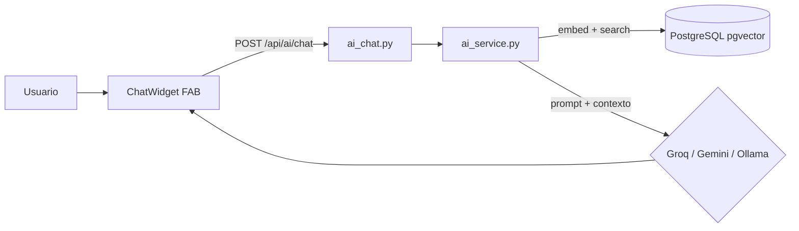

# Asistente IA Calzado J&R — FastAPI + pgvector + Groq/Gemini + Widget React

> **Costo:** $0/mes (free tier) | **MVP:** 5-7 días | **Sin servicios extra, solo tu stack actual**

## 1. Qué es

Chatbot custom dentro del monorepo. Vive en `be/app/routers/ai_chat.py` + `be/app/services/ai_service.py`, usa `pgvector` en PostgreSQL para RAG sobre tus 65 productos + FAQs, y consume LLM agnóstico por variable `AI_PROVIDER`.

- **Por defecto:** `Groq` (Llama 3.3 70B, 14.400 req/día gratis, <1s) o `Gemini 2.0 Flash` (60 req/min gratis)
- **Fallback offline:** `Ollama` local (Llama 3.2 3B, $0 para siempre, sin internet, sin que datos salgan)
- Cambias de uno a otro solo con `AI_PROVIDER` en `.env`, sin reescribir código.

## 2. Cómo funciona



1. Usuario escribe en `ChatWidget` (FAB flotante junto a `WhatsAppButton` en `LandingPage.tsx`).
2. Backend valida (max 500 chars, anti prompt-injection), rate limit 10 req/min por IP.
3. Genera embedding local (`nomic-embed-text`, gratis) y busca top 5 en `ai_embeddings` (productos reales + FAQs).
4. Arma prompt: "Eres asistente Calzado J&R, tono amable colombiano, responde solo con catálogo, si no sabes deriva a WhatsApp, nunca inventes tallas".
5. Llama a Groq/Gemini/Ollama y devuelve respuesta streaming + `sources` + `suggested_products`.

**No depende de tu PC** con Groq/Gemini (corre en la nube, solo necesitas internet). Solo Ollama local sí requiere 8GB RAM.

## 3. Qué se crea / modifica

**Backend `be/`:**
- `be/app/config.py` → vars `AI_PROVIDER`, `AI_API_KEY`, `AI_MODEL`, `AI_EMBEDDING_MODEL`
- `db/init/init.sql` → `CREATE EXTENSION vector;`
- `be/alembic/versions/xxx_add_pgvector.py` → tabla `ai_embeddings(id, content, embedding vector(768), metadata JSONB)`
- `be/app/routers/ai_chat.py` → `POST /api/ai/chat` (público), `GET /api/ai/health`, `POST /api/ai/embeddings/reindex` (solo jefe)
- `be/app/services/ai_service.py` → RAG + llamada LLM
- `be/app/services/ai_tools.py` → `buscar_productos`, `consultar_mis_pedidos` (con JWT)
- `be/app/schemas/ai.py` → `ChatRequest/ChatResponse`
- `be/scripts/seed_ai_embeddings.py` → indexa `sample_products.csv` + `seed_data.py` + FAQs
- `be/pyproject.toml` → `openai`, `groq`, `google-generativeai`, `pgvector`, `tiktoken`

**Frontend `fe/`:**
- `fe/src/features/ai/components/organisms/ChatWidget.tsx` (FAB colapsable, basado en `WhatsAppButton` + `Modal`)
- `fe/src/services/aiApi.ts` + `fe/src/hooks/useChat.ts` (streaming)
- `fe/src/pages/public/LandingPage.tsx` → integra `<ChatWidget />` junto a `<WhatsAppButton />`
- `fe/src/features/ai/` también en `AppLayout`/`AdminLayout`/`ClientLayout`/`EmployeeLayout` para modo autenticado

**Mobile:** `mobile/components/ChatWidget.tsx` (mismo endpoint con SecureStore)

## 4. Beneficios

| Rol | Para qué sirve |
|---|---|
| **Visitante** | Dudas 24/7, recomienda productos ("bota talla 42 antideslizante"), guía registro RF-001, captura lead |
| **Cliente** | "¿Dónde va mi pedido #123?", ayuda armar pedido mayorista, búsqueda semántica |
| **Empleado** | Explica tareas, cómo reportar incidencia, resume rendimiento |
| **Jefe** | "¿Qué producto tuvo más scrap este mes?", genera descripciones, clasifica incidencias |

## 5. Costos — ¿Es gratis?

**Sí, $0/mes para tu volumen (<100 chats/día):**

| Concepto | Costo |
|---|---|
| Groq 14.400 req/día / Gemini 60 req/min | **$0**, sin tarjeta. 100 chats/día = 3k/mes << límite |
| Embeddings `nomic-embed-text` local | **$0** |
| `pgvector` + widget + backend | **$0** licencia |

**Solo pagarías si superas free tier** (ej 500 chats/día → ~$1-5/mes en Groq $0.59/1M tokens) o si migras voluntariamente a OpenAI GPT-4o-mini ($0.15/1M). Con Ollama local es **$0 para siempre**, sin límites.

## 6. ¿Necesito VPS? ¿Cuál?

**Desarrollo:** No. Docker local + internet es suficiente. PC SENA 8GB sirve.

**Producción (landing 24/7):** Sí, si quieres público. Si es solo demo SENA, basta `localhost` o `ngrok`.

| Uso | VPS recomendado | Precio |
|---|---|---|
| **Groq/Gemini (recomendado)** | **Hetzner CX11** (2GB, 1 vCPU) o **Oracle Always Free** (24GB) | **$4.10/mes (~$16k COP) o $0** |
| **Ollama 3B local** | Contabo VPS S (4GB) / Hetzner CPX21 (8GB) | $5.50-10/mes |
| **Demo sin costo** | Railway/Render free tier + Groq free | $0 |

Para Groq no necesitas GPU ni 8GB. Solo FastAPI + PG.

## 7. Requisitos

- PC dev: 8GB RAM, Docker, pnpm, uv, internet
- Servidor Groq: 1GB RAM, 20GB SSD
- Servidor Ollama 3B: 8GB RAM, 30GB SSD (CPU ok, 2-5s)
- Cliente: navegador, widget <50KB

## 8. Plan de implementación

- **Fase 0 (1-2 días):** Añadir `vector` a `db/init/init.sql`, migración Alembic, vars `AI_*` en `.env.example` y `config.py`
- **Fase 1 (5-7 días) MVP landing:** RAG + `ai_chat.py` + `ChatWidget` en `LandingPage.tsx` + prompt + rate limit + `seed_ai_embeddings.py`
- **Fase 2 (7-10 días):** Tools con JWT + contexto por rol + widget en layouts autenticados + mobile
- **Fase 3 (2-3 sem):** Búsqueda semántica `GET /api/catalog/search/semantic`, recomendador, `POST /api/ai/generate-description`, webhook WhatsApp
- **Fase 4 (3-5 días):** `docker-compose.prod.yml` (ollama opcional), CI `ruff/pytest/tsc`, docs

## 9. Cómo iniciar cuando quieras implementarlo

Copia este checklist al crear la rama:

```bash
git checkout -b feat/ai-chatbot
# 1. DB
# - Editar db/init/init.sql: CREATE EXTENSION vector;
# - Crear migración: cd be && uv run alembic revision -m "add pgvector ai_embeddings"
# 2. Config
# - Añadir a .env.example y be/app/config.py: AI_PROVIDER=groq, AI_API_KEY, AI_MODEL=llama-3.3-70b-versatile
# - Conseguir API key gratis: https://console.groq.com/keys (sin tarjeta) o https://aistudio.google.com/app/apikey
# 3. Backend
# - cd be && uv add openai groq google-generativeai pgvector tiktoken
# - Crear be/app/routers/ai_chat.py, be/app/services/ai_service.py, be/app/schemas/ai.py, be/scripts/seed_ai_embeddings.py
# - Registrar router en be/app/main.py lifespan
# 4. Frontend
# - Crear fe/src/features/ai/components/organisms/ChatWidget.tsx
# - Crear fe/src/services/aiApi.ts y fe/src/hooks/useChat.ts
# - Integrar en fe/src/pages/public/LandingPage.tsx junto a WhatsAppButton
# 5. Probar
# - docker compose up -d --build
# - curl -X POST http://localhost:8000/api/ai/chat -H "Content-Type: application/json" -d '{"message":"¿Cómo ser cliente mayorista?"}'
# - Abrir http://localhost:5173 y probar widget
```

**Primer prompt a usar en `be/app/services/prompts/system_prompt.txt`:**
> Eres asistente Calzado J&R, experto calzado mayorista colombiano. Responde solo con info del catálogo y FAQs proporcionadas. Si no sabes, deriva a WhatsApp 573001234567. Nunca inventes tallas, precios o stock. Tono amable, conciso.

**Verificación MVP:** `uv run ruff check && uv run pytest tests/test_ai_chat.py -v` (mock LLM), `npx tsc -b && pnpm test` (ChatWidget), rate limit 11 req/min → 429, prompt injection rechazado.

---
*Calzado J&R — FastAPI + React 19 + PostgreSQL 17 — Sept 2026*
