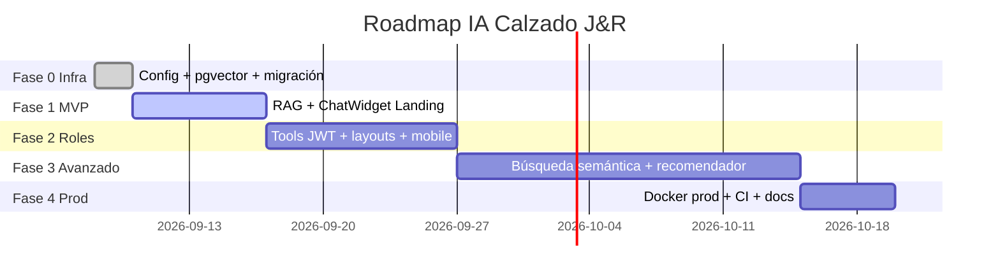

# Plan de Implementación IA — Calzado J&R — Desarrollo por Fases

> **Objetivo:** Implementar un asistente IA conversacional dentro del sistema Calzado J&R de forma **incremental, segura y testeable**, sin romper el sistema actual. Cada fase es un entregable funcional que puedes probar, presentar al SENA y desplegar por separado.
>
> **Stack:** FastAPI + PostgreSQL 17 + pgvector + Groq/Gemini (gratis) + React 19 + Widget FAB
> **Costo total fases 0-2:** $0/mes | **Tiempo total MVP (Fase 0+1):** 6-9 días | **Proyecto completo:** 5-6 semanas a ritmo SENA

---

## Índice
1. [Principios del plan](#1-principios-del-plan)
2. [Mapa general de fases](#2-mapa-general-de-fases)
3. [Requisitos previos](#3-requisitos-previos)
4. [Fase 0 — Infraestructura (1-2 días)](#4-fase-0--infraestructura-y-configuración-1-2-días)
5. [Fase 1 — MVP Landing (5-7 días)](#5-fase-1--mvp-chatbot-en-landing-5-7-días--entregable-demo-sena)
6. [Fase 2 — Contexto por Rol (7-10 días)](#6-fase-2--contexto-por-rol-y-tools-con-jwt-7-10-días)
7. [Fase 3 — Funcionalidades Avanzadas (2-3 semanas)](#7-fase-3--funcionalidades-avanzadas-2-3-semanas)
8. [Fase 4 — Producción y Hardening (3-5 días)](#8-fase-4--producción-y-hardening-3-5-días)
9. [Cómo ir ensayando de a pocos (estrategia de ramas)](#9-cómo-ir-ensayando-de-a-pocos-estrategia-de-ramas)
10. [Checklist global y verificación](#10-checklist-global-y-verificación)
11. [Costos reales](#11-costos-reales)
12. [FAQ y errores comunes](#12-faq-y-errores-comunes)

---

## 1. Principios del plan

| Principio | Qué significa en la práctica |
|---|---|
| **Incremental** | Cada fase funciona sola. No necesitas terminar la Fase 3 para mostrar la Fase 1 al instructor. |
| **Sin romper lo existente** | La IA vive en archivos nuevos (`ai_chat.py`, `ai_service.py`, `ChatWidget.tsx`). No tocas `auth`, `orders`, `catalog` hasta Fase 2. |
| **Testeable** | Cada fase tiene su comando `curl` / test / verificación. Si falla, sabes exactamente dónde. |
| **$0 al inicio** | Fases 0-2 usan Groq (14.400 req/día gratis) o Gemini (60 req/min gratis) + embeddings locales. Sin tarjeta, sin VPS. |
| **Agnóstico de LLM** | Cambias `AI_PROVIDER=groq` → `gemini` → `ollama` en `.env` sin reescribir código. |



---

## 2. Mapa general de fases

| Fase | Nombre | Duración | Qué entregas | ¿Se puede presentar al SENA? | ¿Requiere VPS? |
|---|---|---|---|---|---|
| **0** | Infraestructura | 1-2 días | `pgvector` instalado, migración `ai_embeddings`, vars `AI_*` en config | No (técnico) | No |
| **1** | **MVP Landing** | 5-7 días | Chatbot público en `LandingPage.tsx` que responde con catálogo real (65 productos) + FAQs, rate limit, anti prompt-injection | **SÍ — Demo principal** | No (Groq en la nube) |
| **2** | Contexto por Rol | 7-10 días | Chat entiende quién eres (visitante/cliente/empleado/jefe), consulta pedidos reales, widget en todos los layouts + mobile | Sí — Demo roles | No |
| **3** | Avanzado | 2-3 semanas | Búsqueda semántica, recomendador, generador de descripciones, webhook WhatsApp | Sí — Proyecto grado | Opcional |
| **4** | Producción | 3-5 días | `docker-compose.prod.yml` con HTTPS, CI, monitoreo | Sí — Despliegue | Sí, si quieres 24/7 |

> **Recomendación SENA:** Haz **Fase 0 + Fase 1** y ya tienes proyecto defendible. Las demás son plus.

---

## 3. Requisitos previos

**En tu PC (ya los tienes):**
- Docker Desktop, `uv` (Python 3.12+), `pnpm`, Git, VS Code
- 8GB RAM, internet
- `.env` configurado y `docker compose up -d --build` funcionando

**Cuentas gratis (5 min):**
- **Groq** (recomendado): https://console.groq.com/keys → Create API Key (sin tarjeta, 14.400 req/día)
- **Alternativa Gemini:** https://aistudio.google.com/app/apikey (60 req/min gratis)
- Guarda la key para Fase 0.

**No necesitas:**
- GPU, VPS, OpenAI pago, ni instalar Ollama aún.

---

## 4. Fase 0 — Infraestructura y Configuración (1-2 días)

### Objetivo
Dejar la base de datos y la configuración listas para IA, sin escribir lógica de chatbot aún. Si esto queda bien, todo lo demás es solo código.

### Por qué primero
`pgvector` es una extensión de PostgreSQL. Si no está instalada antes de crear la tabla `ai_embeddings`, la migración falla. Es como poner los cimientos antes de la casa.

### Tareas exactas

#### 4.1 Base de datos
**Archivo:** `db/init/init.sql` — añadir al final:
```sql
-- IA: búsqueda semántica
CREATE EXTENSION IF NOT EXISTS vector;
```

**Nueva migración Alembic:**
```bash
cd be
uv run alembic revision -m "add pgvector ai_embeddings"
```
Editar `be/alembic/versions/xxx_add_pgvector_ai_embeddings.py`:
```python
def upgrade():
    op.execute("CREATE EXTENSION IF NOT EXISTS vector")
    op.create_table(
        "ai_embeddings",
        sa.Column("id", sa.Integer, primary_key=True),
        sa.Column("content", sa.Text, nullable=False),
        sa.Column("embedding", sa.VECTOR(768), nullable=False),
        sa.Column("metadata", sa.JSONB, nullable=True),
        sa.Column("created_at", sa.DateTime, server_default=sa.func.now()),
    )
    op.create_index("ix_ai_embeddings_embedding", "ai_embeddings", ["embedding"], postgresql_using="ivfflat")

def downgrade():
    op.drop_table("ai_embeddings")
    op.execute("DROP EXTENSION IF EXISTS vector")
```

#### 4.2 Configuración
**Archivo:** `.env.example` — añadir:
```env
# ── IA ──
AI_PROVIDER=groq
AI_API_KEY=tu_key_de_groq_aqui
AI_MODEL=llama-3.3-70b-versatile
AI_EMBEDDING_MODEL=nomic-embed-text
AI_MAX_TOKENS=512
```

**Archivo:** `be/app/config.py` — añadir en `Settings`:
```python
AI_PROVIDER: str = "groq"  # groq | gemini | ollama
AI_API_KEY: str = ""
AI_MODEL: str = "llama-3.3-70b-versatile"
AI_EMBEDDING_MODEL: str = "nomic-embed-text"
AI_MAX_TOKENS: int = 512
```

**Archivo:** `be/pyproject.toml` — añadir dependencias:
```bash
cd be && uv add pgvector openai groq google-generativeai tiktoken
# pgvector = tipo VECTOR para SQLAlchemy
# openai = cliente compatible Groq
# groq = SDK oficial (opcional)
# google-generativeai = para Gemini
# tiktoken = contar tokens
```

### Cómo probar Fase 0
```bash
docker compose down -v
docker compose up -d --build
docker exec -it calzado_jyr_db psql -U jyr_user -d calzado_jyr_db -c "\dx"  # debe listar 'vector'
docker exec -it calzado_jyr_db psql -U jyr_user -d calzado_jyr_db -c "\d ai_embeddings"
cd be && uv run alembic history  # debe mostrar la nueva migración
uv run ruff check  # sin errores
```

### Criterio de éxito
- `docker compose up` no da error.
- `\dx` muestra `vector`.
- `ai_embeddings` existe vacía.
- `be/app/config.py` carga `AI_PROVIDER` sin error.

### Qué NO hacer aún
No crear `ai_chat.py` ni `ChatWidget.tsx`. Solo infra.

---

## 5. Fase 1 — MVP Chatbot en Landing (5-7 días) — *Entregable Demo SENA*

### Objetivo
Un visitante entra a `http://localhost:5173`, ve un botón flotante (FAB) junto al de WhatsApp, escribe *"¿Tienen botas talla 42 antideslizantes?"* y recibe respuesta real basada en tus 65 productos, sin inventar.

### Arquitectura
```mermaid
flowchart LR
    U[Usuario] --> W[ChatWidget FAB]
    W -->|POST /api/ai/chat {message}| BE[routers/ai_chat.py]
    BE --> SVC[services/ai_service.py]
    SVC -->|1. embed local| EMB[nomic-embed-text]
    SVC -->|2. search top 5| PG[(PostgreSQL pgvector ai_embeddings)]
    SVC -->|3. prompt + contexto| LLM{Groq / Gemini}
    LLM -->|respuesta + sources| W
```

### Tareas Backend `be/`

| Archivo | Qué hace | Clave |
|---|---|---|
| `be/app/schemas/ai.py` | `ChatRequest(message: str max 500)`, `ChatResponse(answer, sources, suggested_products)` | Validación Pydantic |
| `be/app/services/ai_service.py` | `embed(text)`, `search(query, k=5)`, `build_prompt(query, contexts)`, `call_llm(prompt)` | RAG + LLM agnóstico |
| `be/app/routers/ai_chat.py` | `POST /api/ai/chat` (público, rate limit 10/min por IP), `GET /api/ai/health`, `POST /api/ai/embeddings/reindex` (solo jefe) | Rate limit + anti prompt-injection |
| `be/app/services/prompts/system_prompt.txt` | Prompt base | Ver abajo |
| `be/scripts/seed_ai_embeddings.py` | Lee `docs/sample_products.csv` + `be/app/init/seed_data.py` + FAQs y genera embeddings | Se ejecuta 1 vez |

**Prompt base (`system_prompt.txt`):**
```
Eres asistente de Calzado J&R, experto en calzado mayorista colombiano.
- Responde SOLO con info del catálogo y FAQs proporcionadas en el contexto.
- Si no sabes la respuesta, deriva a WhatsApp 3137061602 con mensaje amable.
- NUNCA inventes tallas, precios, stock o modelos.
- Tono: amable, conciso, colombiano, máximo 4 frases.
- Si preguntan cómo ser cliente mayorista, explica RF-001 (registro en landing).
```

**Validaciones obligatorias en `ai_chat.py`:**
- `len(message) <= 500` → 422 si excede
- Bloquear prompt injection: si `message` contiene `ignore previous instructions`, `system:`, `jailbreak` → 400
- Rate limit: 10 req/min por IP (usa `slowapi` o `app/middleware/rate_limit.py` existente)

### Tareas Frontend `fe/`

| Archivo | Qué hace | Basado en |
|---|---|---|
| `fe/src/features/ai/components/organisms/ChatWidget.tsx` | FAB colapsable (burbuja abajo-derecha), ventana chat, input, mensajes, typing indicator, lista `sources` | `WhatsAppButton.tsx` + `Modal.tsx` |
| `fe/src/services/aiApi.ts` | `postChat(message): Promise<ChatResponse>` con `fetch` a `/api/ai/chat` | `authService.ts` |
| `fe/src/hooks/useChat.ts` | Estado `messages`, `isLoading`, `sendMessage`, manejo streaming (si aplica) | `useAuth.ts` |
| `fe/src/pages/public/LandingPage.tsx` | Añadir `<ChatWidget />` junto a `<WhatsAppButton />` | Ya existe |

**UX del widget:**
- Cerrado: burbuja con icono 💬 (igual tamaño que WhatsApp, pero lado izquierdo o derecho opuesto)
- Abierto: panel 380x500px, header "Asistente J&R", historial, input + botón enviar, footer "Respuestas con IA, verifica con asesor"
- Usa `PageTransition` y `Modal` existentes, no crear modal manual.

### Comandos Fase 1
```bash
# Backend
cd be
uv run python scripts/seed_ai_embeddings.py  # indexa 65 productos
uv run ruff check && uv run ruff format
uv run pytest tests/test_ai_chat.py -v  # crear este test con mock LLM

# Frontend
cd fe
pnpm install
npx tsc -b
pnpm test  # test ChatWidget render

# Probar manual
docker compose up -d --build
curl -X POST http://localhost:8000/api/ai/chat \
  -H "Content-Type: application/json" \
  -d '{"message":"¿Cómo ser cliente mayorista?"}'
# Debe responder con pasos de registro RF-001 + sources

# Probar rate limit (11 req seguidos → 429)
for i in {1..11}; do curl -s -o /dev/null -w "%{http_code}\n" -X POST http://localhost:8000/api/ai/chat -H "Content-Type: application/json" -d '{"message":"hola"}'; done
```

### Criterio de éxito Fase 1
- [ ] Widget visible en landing junto a WhatsApp, abre/cierra, responsive.
- [ ] Pregunta *"¿Tienen botas talla 42?"* → responde con productos reales de `ai_embeddings`, no inventa.
- [ ] Pregunta fuera de catálogo *"¿Venden sombreros?"* → deriva a WhatsApp.
- [ ] `curl` con 501 chars → 422. Con `ignore previous instructions` → 400.
- [ ] 11 req/min → 429.
- [ ] `uv run ruff check`, `npx tsc -b`, `pnpm test` pasan.
- [ ] No se rompió login, catálogo, pedidos.

### Qué puedes demoar al SENA con solo Fase 1
> "Visitante 24/7, recomienda productos, guía registro, captura lead, $0/mes, sin VPS"

---

## 6. Fase 2 — Contexto por Rol y Tools con JWT (7-10 días)

### Objetivo
El chat ya no es genérico. Si estás logueado, sabe quién eres y puede hacer cosas reales.

| Rol | Ejemplo de pregunta | Qué hace el chat |
|---|---|---|
| **Visitante** | "¿Cómo me registro?" | Explica RF-001 |
| **Cliente** | "¿Dónde va mi pedido #123?" | Llama `consultar_mis_pedidos` con JWT, devuelve estado real |
| **Empleado** | "¿Qué tareas tengo hoy?" | Resume tareas asignadas |
| **Jefe** | "¿Qué producto tuvo más scrap este mes?" | Consulta reportes |

### Tareas

**Backend:**
- `be/app/services/ai_tools.py` — funciones que el LLM puede invocar:
  ```python
  def buscar_productos(query: str, db) -> list[Product]  # búsqueda pgvector
  def consultar_mis_pedidos(user_id: int, db) -> list[Order]  # requiere JWT
  def consultar_mis_tareas(user_id: int, db) -> list[Task]
  ```
- `be/app/routers/ai_chat.py` — ahora acepta `Authorization: Bearer <JWT>` opcional. Si viene token, decodifica `user_id` y `role`, lo pasa a `ai_service.py` para elegir prompt y tools.
- Prompt por rol: visitante (catálogo), cliente (pedidos), empleado (tareas), jefe (reportes).

**Frontend:**
- `fe/src/features/ai/components/organisms/ChatWidget.tsx` — ahora envía `Authorization` si `useAuth().token` existe.
- Integrar widget en `AppLayout.tsx`, `AdminLayout.tsx`, `ClientLayout.tsx`, `EmployeeLayout.tsx` (no solo landing).
- `mobile/components/ChatWidget.tsx` — mismo endpoint con `expo-secure-store`.

### Cómo probar
```bash
# Sin login (visitante)
curl -X POST http://localhost:8000/api/ai/chat -H "Content-Type: application/json" -d '{"message":"¿Dónde va mi pedido?"}'
# → "Inicia sesión para consultar pedidos"

# Con login cliente
TOKEN=$(curl -s -X POST http://localhost:8000/api/auth/login -H "Content-Type: application/json" -d '{"email":"cliente@test.com","password":"Test123456!"}' | jq -r .access_token)
curl -X POST http://localhost:8000/api/ai/chat -H "Content-Type: application/json" -H "Authorization: Bearer $TOKEN" -d '{"message":"¿Dónde va mi pedido 123?"}'
# → estado real del pedido 123 si pertenece al cliente, 403 si no
```

### Criterio de éxito
- [ ] Sin token → no expone datos privados.
- [ ] Con token cliente → solo ve sus pedidos.
- [ ] Widget funciona en `/admin`, `/client`, `/employee`, no solo `/`.
- [ ] Mobile widget funciona.

---

## 7. Fase 3 — Funcionalidades Avanzadas (2-3 semanas)

> Haz esta fase solo si Fase 1 y 2 están estables. Es el "plus" para nota alta.

| Funcionalidad | Endpoint | Para quién | Esfuerzo |
|---|---|---|---|
| **Búsqueda semántica catálogo** | `GET /api/catalog/search/semantic?q=bota antideslizante talla 42` | Todos | 2-3 días |
| **Recomendador** | `GET /api/ai/recommend?product_id=123` | Cliente | 3-4 días |
| **Generador descripciones** | `POST /api/ai/generate-description {product_id}` (solo jefe) | Jefe | 2 días |
| **Clasificador incidencias** | `POST /api/ai/classify-incidence {text}` | Jefe/Empleado | 3 días |
| **Webhook WhatsApp** | `POST /api/ai/whatsapp/webhook` | Visitante | 5 días |

**Ejemplo búsqueda semántica:**
```python
# be/app/routers/catalog.py
@router.get("/search/semantic")
def semantic_search(q: str, db: Session = Depends(get_db)):
    embedding = embed(q)
    results = db.query(Product).order_by(Product.embedding.l2_distance(embedding)).limit(10).all()
    return results
```

**Criterio de éxito:** Cada endpoint tiene test, no rompe catálogo existente, y el recomendador no sugiere productos inactivos.

---

## 8. Fase 4 — Producción y Hardening (3-5 días)

### Objetivo
Que el chatbot funcione 24/7 fuera de tu PC, con HTTPS y monitoreo.

### Tareas
- `docker-compose.prod.yml` — añadir servicio `ollama` opcional (solo si quieres $0 para siempre sin Groq):
  ```yaml
  ollama:
    image: ollama/ollama
    volumes: [ollama_data:/root/.ollama]
  ```
- `fe/nginx.prod.conf` — ya tiene proxy `/api/` → `be:8000`, no tocar.
- CI `.github/workflows/ci.yml` — añadir:
  ```yaml
  - run: cd be && uv run ruff check && uv run pytest tests/test_ai_chat.py
  - run: cd fe && npx tsc -b && pnpm test
  ```
- Variables prod: `AI_PROVIDER=groq`, `AI_API_KEY` en `.env` del servidor (nunca en git).
- Logs: `be/app/logging_config.py` ya existe, añadir `logger.info("ai_chat", extra={...})`.

### Dónde desplegar (si es solo demo SENA, no necesitas)
| Opción | Precio | Para qué |
|---|---|---|
| **No desplegar** (solo `localhost` + `ngrok`) | $0 | Demo en clase |
| **Oracle Always Free** (24GB RAM) | $0 | Prod real gratis |
| **Hetzner CX11** (2GB) | $4.10/mes (~$16k COP) | Prod barato |
| **Railway/Render free tier** | $0 | Demo temporal |

### Criterio de éxito
- [ ] `docker compose -f docker-compose.prod.yml up -d --build` levanta con HTTPS.
- [ ] `https://tu-dominio.com/api/ai/health` → 200.
- [ ] CI pasa en GitHub Actions.

---

## 9. Cómo ir ensayando de a pocos (estrategia de ramas)

**Regla de oro:** Una rama por fase, merge solo cuando la fase pasa todos sus checks.

```bash
# Fase 0
git checkout -b feat/ai-fase0-infra
# ... haces cambios Fase 0 ...
docker compose up -d --build  # pruebas
git add db/init/init.sql be/alembic/versions/xxx* be/app/config.py .env.example be/pyproject.toml
git commit -m "feat(ai): fase 0 infra pgvector + config"
git push -u origin feat/ai-fase0-infra
# PR → merge a main solo si checks pasan

# Fase 1
git checkout main && git pull
git checkout -b feat/ai-fase1-mvp
# ... haces cambios Fase 1 ...
curl -X POST http://localhost:8000/api/ai/chat -d '{"message":"hola"}'  # pruebas
git commit -m "feat(ai): fase 1 MVP ChatWidget + RAG"
# ... igual ...

# Si algo se rompe, vuelves atrás sin perder lo anterior:
git checkout main  # siempre estable
```

**Checklist antes de mergear cada fase:**
```bash
.\scripts\check.ps1          # o git push (pre-push hook corre ruff, pytest, tsc, pnpm test)
docker compose up -d --build # levanta sin errores
curl http://localhost:8000/api/ai/health  # 200
```

**Cómo ensayar sin miedo:**
1. Haz Fase 0 hoy (1 hora). Si falla, `git checkout main` y sigues con tu sistema normal.
2. Cuando Fase 0 esté en `main`, empieza Fase 1. Cada día haz `git commit` pequeño.
3. No avances a Fase 2 hasta que Fase 1 esté mergeada y demoada.

---

## 10. Checklist global y verificación

### Checklist por fase (copia y pega en tu PR)

**Fase 0:**
- [ ] `CREATE EXTENSION vector` en `db/init/init.sql`
- [ ] Migración `ai_embeddings` creada y aplicada
- [ ] Vars `AI_*` en `.env.example` y `config.py`
- [ ] `uv add pgvector openai groq google-generativeai tiktoken`
- [ ] `docker compose up -d --build` OK, `\dx` muestra vector

**Fase 1:**
- [ ] `POST /api/ai/chat` público, validación 500 chars, anti injection, rate limit 10/min
- [ ] `seed_ai_embeddings.py` indexa 65 productos
- [ ] `ChatWidget.tsx` en `LandingPage.tsx` junto a `WhatsAppButton`
- [ ] `curl` responde con catálogo real, deriva a WhatsApp si no sabe
- [ ] `ruff`, `pytest`, `tsc`, `pnpm test` pasan

**Fase 2:**
- [ ] Tools con JWT, prompt por rol
- [ ] Widget en todos los layouts + mobile
- [ ] Sin token no expone datos privados

**Fase 3:**
- [ ] `GET /api/catalog/search/semantic` funciona
- [ ] Recomendador no sugiere inactivos

**Fase 4:**
- [ ] `docker-compose.prod.yml` + CI + docs

---

## 11. Costos reales

| Concepto | Costo Fase 0-2 | Cuándo pagarías |
|---|---|---|
| Groq 14.400 req/día / Gemini 60 req/min | **$0** sin tarjeta | Solo si >400 chats/día sostenidos |
| Embeddings `nomic-embed-text` local | **$0** | Nunca |
| `pgvector` + widget + backend | **$0** | Nunca |
| VPS Hetzner CX11 (si quieres 24/7) | **$4.10/mes** | Solo si despliegas prod |
| Ollama local (alternativa $0 para siempre) | **$0** | Requiere 8GB RAM, sin internet |

> Con 100 chats/día = 3.000/mes << 432.000 gratis de Groq. No pagarás.

---

## 12. FAQ y errores comunes

**¿Puedo saltarme Fase 0?** No. Sin `pgvector`, Fase 1 falla.

**¿Necesito saber de IA?** No. Solo copias el prompt y el `seed` script. El RAG es `embed + search + prompt`.

**¿Si Groq se cae?** Cambias `.env` a `AI_PROVIDER=gemini` y reinicias `docker compose up -d`. Sin reescribir código.

**¿Y si quiero $0 para siempre sin depender de Groq?** Fase 4: `AI_PROVIDER=ollama`, `docker compose --profile ollama up`. Requiere 8GB RAM y 2-5s por respuesta.

**Error `extension vector does not exist`:** Olvidaste `CREATE EXTENSION vector` en `init.sql` o no hiciste `docker compose down -v` (el volumen viejo no tiene la extensión).

**Error `AI_API_KEY missing`:** Añade `AI_API_KEY` a `.env` (no a `.env.example`).

**Widget no aparece:** Verifica que `LandingPage.tsx` importa `ChatWidget` y que `fe/src/services/aiApi.ts` apunta a `VITE_API_URL`.

**¿Dónde pido ayuda?** Issues del repo con label `ai`, o revisa `docs/project-documentation/GUIA_IMPLEMENTACION_IA.md` (guía técnica resumida).

---

## Próximo paso inmediato

```bash
git checkout -b feat/ai-fase0-infra
# 1. Edita db/init/init.sql → añade CREATE EXTENSION vector;
# 2. Crea migración: cd be && uv run alembic revision -m "add pgvector ai_embeddings"
# 3. Añade vars AI_* a .env.example y be/app/config.py
# 4. Consigue key gratis: https://console.groq.com/keys
# 5. docker compose up -d --build && verifica \dx
```

Cuando Fase 0 esté verde, avísame y armamos Fase 1 juntos.

---
*Calzado J&R — FastAPI + React 19 + PostgreSQL 17 — Sept 2026 — Plan por fases incremental*
