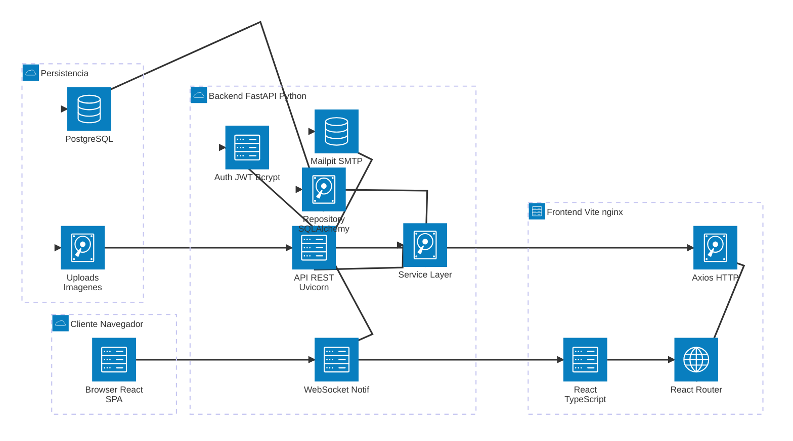

# 🏗️ Arquitectura del Software

**Sistema de Gestión Integral — CALZADO J&R**

> **Versión del documento:** 1.0
> **Última actualización:** Julio 2026
> **Stack verificado contra:** `package.json`, `pyproject.toml`, `docker-compose.yml`, `Dockerfile` (backend y frontend), `tsconfig.json`, `vite.config.ts`

---

## 1. Selección del Stack Tecnológico

La selección del stack responde a los principios de **tipado fuerte**, **rendimiento**, **escalabilidad horizontal** y **curva de aprendizaje moderada** para un equipo de 3 desarrolladores.

### 1.1. Frontend

| Tecnología | Versión | Propósito |
|---|---|---|
| **React** | 19.2.0 | Biblioteca UI basada en componentes con Virtual DOM y JSX. |
| **TypeScript** | ~5.9.3 | Tipado estático estricto (`strict: true`, `noUncheckedIndexedAccess`) que elimina bugs en tiempo de compilación. |
| **Vite** | 7.2.4 | Build tool y dev server con HMR ultrarrápido. |
| **TailwindCSS** | 4.1.18 | Framework CSS utility-first con compilación Just-In-Time (JIT). |
| **React Router DOM** | 7.13.0 | Enrutamiento SPA del lado del cliente. |
| **Axios** | 1.13.4 | Cliente HTTP con interceptores para adjuntar tokens JWT. |
| **Lucide React** | 0.563.0 | Librería de iconos open-source (tree-shakeable). |
| **i18next** | 23.10.1 | Internacionalización (multiidioma activo con ES/EN). |
| **jsPDF + jsPDF-autotable** | 4.2.1 / 5.0.7 | Exportación de reportes a PDF. |
| **xlsx / xlsx-js-style** | 0.18.5 / 1.2.0 | Exportación a Excel con estilos. |
| **Vitest** | 4.0.18 | Framework de testing unitario (compatible con JSDOM). |
| **ESLint** | 9.39.1 | Linting con flat config y typescript-eslint v8. |
| **Prettier** | 3.8.1 | Formateo de código consistente. |
| **pnpm** | 10 (vía Corepack) | Gestor de paquetes. |

### 1.2. Backend

| Tecnología | Versión | Propósito |
|---|---|---|
| **Python** | >=3.12 | Lenguaje con tipado moderno (`list[str]`, `type` alias) y sintaxis limpia. |
| **FastAPI** | >=0.115.0 | Framework web asíncrono de alto rendimiento con validación automática via Pydantic y documentación OpenAPI interactiva. |
| **Uvicorn** | >=0.32.0 | Servidor ASGI con soporte HTTP/1.1 y WebSocket. |
| **SQLAlchemy** | >=2.0.0 | ORM maduro con patrón Unit of Work, eager/lazy loading, y soporte completo para PostgreSQL. |
| **Alembic** | >=1.14.0 | Migraciones versionadas del esquema de base de datos (37 migraciones actualmente). |
| **Pydantic** | >=2.0.0 | Validación de datos con modelos tipados (reemplaza a dataclasses). |
| **Pydantic Settings** | >=2.0.0 | Gestión de configuración desde variables de entorno con tipado. |
| **python-jose** | >=3.3.0 | Generación y verificación de tokens JWT (HS256). |
| **passlib[bcrypt]** | >=1.7.0 | Hashing de contraseñas con esquema bcrypt. |
| **bcrypt** | >=4.0.0, <4.1.0 | Implementación C nativa del algoritmo bcrypt. |
| **psycopg2-binary** | >=2.9.0 | Driver PostgreSQL para Python. |
| **aiosmtplib** | >=3.0.0 | Envío asíncrono de correos electrónicos. |
| **python-multipart** | >=0.0.18 | Soporte para subida de archivos (avatares, imágenes de producto). |
| **Pytest** | >=8.0.0 | Testing con `asyncio_mode = "auto"` (tests async sin decorador). |
| **httpx** | >=0.27.0 | Cliente HTTP asíncrono para testing de API. |
| **Ruff** | >=0.8.0 | Linter y formateador unificado (reemplaza a flake8 + isort + black). Line-length: 100. |

**Gestor de dependencias:** UV (instalado via pip, resuelve desde `pyproject.toml`)

### 1.3. Base de Datos

| Tecnología | Versión | Propósito |
|---|---|---|
| **PostgreSQL** | 17 Alpine | Motor relacional con integridad referencial, UUID nativo, y buen soporte de concurrencia (MVCC). |
| **Imagen Docker** | `postgres:17-alpine` | ~10 MB, mínimo en disco. |

### 1.4. Infraestructura y DevOps

| Tecnología | Versión | Propósito |
|---|---|---|
| **Docker** | Compose V2 | Orquestación multi-servicio (db + be + fe + mailpit). |
| **nginx** | Alpine | Servidor web para producción (stage `prod` del Dockerfile frontend). Sirve archivos estáticos compilados por Vite. |
| **Mailpit** | latest | Servidor SMTP de prueba en desarrollo. Interfaz web en `http://localhost:8025`. |
| **Red Docker** | Bridge (`calzado_jyr_net`) | Aislamiento de red entre servicios. |

---

## 2. Lenguajes y Frameworks de Frontend

El frontend es una **Single Page Application (SPA)** construida con **React 19** + **TypeScript 5.9** en modo estricto.

### 2.1. Estructura de Componentes

```
src/
├── features/          # Features funcionales (admin, auth, client, employee, landing)
│   ├── pages/         # Páginas del módulo (30+ páginas)
│   ├── components/    # Componentes específicos del módulo
│   ├── services/      # Llamadas API (Axios)
│   ├── context/       # Estado local con React Context
│   ├── types/         # Interfaces TypeScript
│   └── utils/         # Utilidades específicas
├── components/atoms/  # Componentes UI reutilizables (Modal, Button, PageTransition, etc.)
├── api/               # Configuración Axios (interceptors, base URL)
├── hooks/             # Custom hooks (useModalDialog, etc.)
├── context/           # Contextos globales (AuthContext)
├── locales/           # Archivos i18n (es, en)
├── config/            # Configuración del frontend
└── types/             # Tipos globales
```

### 2.2. Enrutamiento

React Router DOM v7 maneja 5 grupos de rutas protegidas por rol:

| Grupo | Ruta base | Rol | # Páginas |
|---|---|---|---|
| Landing | `/` | Público | 2 |
| Auth | `/auth` | Público | 7 |
| Jefe | `/jefe` | `admin` | 14 |
| Empleado | `/empleado` | `empleado` | 6 |
| Cliente | `/cliente` | `cliente` | 2 |

### 2.3. Patrones de UI Implementados

- **Modal base**: Portal + `role="dialog"` + `aria-modal="true"` + focus trap + Escape handler. Variantes: `sm`, `md`, `lg`, `xl`, `full` y `default`, `danger`.
- **PageTransition**: Animación `fade-in` + `slide-in-from-top-4` + `duration-500` en cada navegación vía `<Outlet />`.
- **Notificaciones en tiempo real**: WebSocket para badges de conteo en sidebars.

### 2.4. Llamadas HTTP

- **Axios** con interceptor que adjunta el token JWT (`Authorization: Bearer <token>`).
- Proxy de Vite en desarrollo: `/api` → `http://be:8000`.
- Refresh token automático en 401.

---

## 3. Entorno y Frameworks de Backend

### 3.1. Arquitectura en Capas

El backend sigue un patrón **Router → Service → Repository** adaptado de MVC:

```
Cliente HTTP
    ↓
Router (definición de rutas, validación de parámetros, inyección de dependencias)
    ↓
Service (lógica de negocio, reglas, validaciones)
    ↓
Repository (acceso a datos via SQLAlchemy ORM)
    ↓
Base de Datos (PostgreSQL 17)
```

- **Router:** Define endpoints HTTP, valida path/query params, aplica guards de autenticación y rol.
- **Service:** Contiene la lógica de negocio (cálculos, reglas de producción, estados).
- **Repository:** Abstrae las consultas a la BD mediante SQLAlchemy.

No existe una capa "Controller" separada — el router asume ese rol en FastAPI. Algunos módulos fusionan Service y Repository cuando la lógica es simple.

### 3.2. Módulos del Backend

| Módulo | Funcionalidad principal |
|---|---|
| `auth` | Login, refresh token, forgot/reset password, rate limiter (deshabilitado en desarrollo, 500 requests/15min en producción) |
| `users` | CRUD usuarios, avatar upload (`/me/avatar`) con cache-busting (`?v=timestamp`) |
| `admin` | CRUD empleados, clientes, creación sin contraseña, catálogo admin, reportes |
| `dashboard_jefe` | Panel de control del jefe (métricas, reportes) |
| `dashboard_empleado` | Tareas, incidencias, métricas de rendimiento |
| `orders` | Pedidos, line_group, vales de producción |
| `catalog` | Catálogo público de productos |
| `client` | Dashboard cliente, historial de pedidos |
| `supplies` | Insumos, inventario, categorías, colores |
| `scrap` | Incidencias (scrap, pérdidas, pendientes de aprobación) |
| `notifications` | WebSocket en tiempo real |
| `type_document` | Tipos de documento |

### 3.3. Middleware de Seguridad

Todos aplicados globalmente en `app/main.py`:

| Middleware | Propósito |
|---|---|
| `CORSMiddleware` | Control de orígenes cruzados (`FRONTEND_URL` desde `.env`) |
| `ErrorHandlerMiddleware` | Manejo centralizado de excepciones |
| `RateLimitMiddleware` | Protección contra fuerza bruta (solo activo en staging/producción) |
| `SecurityHeadersMiddleware` | Headers OWASP Top 10 (XSS, CSP, HSTS, etc.) |

### 3.4. Ciclo de Vida (Lifespan)

Al iniciar, el backend ejecuta automáticamente:

1. **Migraciones Alembic** (`alembic upgrade head`) — 37 migraciones actualmente.
2. **Seed data** (roles, tipos de documento, 65 productos, usuarios de prueba).
3. Inicio del servidor Uvicorn con `--reload` en desarrollo.

---

## 4. Sistema de Gestión de Base de Datos

### 4.1. PostgreSQL 17 Alpine

- **Motor:** Relacional (SQL estándar).
- **Driver:** `psycopg2-binary 2.9+`.
- **ORM:** SQLAlchemy 2.0+ con patrón **Unit of Work**.
- **Migraciones:** Alembic 1.14+ con 37 migraciones versionadas.
- **Pool de conexiones:** Configurado en SQLAlchemy (connection pooling).

### 4.2. Modelo de Datos

Actualmente **23 modelos** centralizados en `be/app/models/`:

- `role`, `user`, `password_reset_token`
- `type_document`
- `category`, `brand`, `style`, `product`
- `order`, `order_detail`, `line_group`
- `supplies`, `product_supplies`
- `scrap` (incidencias)
- `task`, `task_status`
- `notification`
- Y modelos auxiliares para relaciones N:M y auditoría.

### 4.3. Inicialización

```
db/init/init.sql          → Extensiones (UUID, etc.) — se ejecuta al crear el contenedor
Alembic migrations        → Esquema completo (tablas, relaciones, constraints)
Seed data                 → Datos iniciales (roles, catálogo, usuarios de prueba)
```

**Orden real:** `init.sql` (extensiones) → Alembic `init_db.py` (tablas/esquema) → seed data.

---

## 5. Patrón de Arquitectura

### 5.1. Patrón Principal: Cliente-Servidor con API REST

```
┌─────────────┐      HTTP/JSON       ┌──────────────┐      SQL       ┌────────────┐
│  Cliente     │ ◄──────────────────► │  Servidor     │ ◄───────────► │  Base de   │
│  (Browser)   │    JWT Auth          │  API REST     │    ORM        │  Datos     │
│  React SPA   │                      │  FastAPI      │               │  PostgreSQL│
└─────────────┘                      └──────────────┘               └────────────┘
```

**Justificación:** La arquitectura Cliente-Servidor con API REST es la más adecuada porque:

1. **Separación clara de responsabilidades:** El frontend solo se preocupa por la UI; el backend solo por la lógica de negocio y datos.
2. **Independencia tecnológica:** Frontend (React/TypeScript) y backend (Python/FastAPI) pueden desarrollarse y desplegarse por separado.
3. **Escalabilidad:** El backend puede escalar horizontalmente (múltiples workers Uvicorn) sin afectar al frontend.
4. **API RESTful:** Stateless, cacheable, con interfaz uniforme. Cada recurso tiene endpoints claros (`/users/`, `/orders/`, `/tasks/`).
5. **Autenticación stateless con JWT:** No requiere sesiones en servidor, facilitando la escalabilidad.

### 5.2. Patrón Interno del Backend: Capas (Router → Service → Repository)

```
FastAPI Router  →  Service  →  Repository  →  SQLAlchemy ORM  →  PostgreSQL
     │                │              │
     │  Valida Path & │  Lógica de   │  Consultas
     │  Query Params  │  Negocio     │  aisladas
     │  + Inyección   │  (reglas,    │  (CRUD)
     │  de Depend.    │  cálculos)   │
     ▼                ▼              ▼
```

**Nota:** A diferencia de una arquitectura MVC clásica, en FastAPI el **Router** asume las funciones de un controlador (recibir request, validar, llamar al service, devolver response). No existe una capa `controller.py` separada en el proyecto.

**Ventajas del patrón en capas:**
- **Testabilidad:** Cada capa se prueba de forma aislada (repository con base de datos de prueba, service con repository mockeado).
- **Mantenibilidad:** Los cambios en una capa no afectan a las otras (ej: cambiar de ORM solo requiere modificar repository).
- **Reutilización:** Un mismo service puede ser usado por diferentes routers.

### 5.3. Patrón en Frontend: Componentes + Context API

- **Componentes atómicos:** `Button`, `Modal`, `Input` reutilizables en `components/atoms/`.
- **Páginas:** Composición de componentes + lógica de negocio específica.
- **Context API:** Estado global (AuthContext, EmployeeBadgeCountsContext) sin necesidad de Redux.
- **Servicios:** Capa de abstracción para llamadas HTTP (Axios) por módulo.

---

## 6. Diagrama de Arquitectura del Sistema

### 6.1. Diagrama de Contenedores (Nivel 2 — C4 Model)

```
┌──────────────────────────────────────────────────────────────────┐
│                        USUARIO (Navegador)                        │
│                         http://localhost:5173                      │
└────────────────────────────┬─────────────────────────────────────┘
                             │
                             ▼
┌──────────────────────────────────────────────────────────────────┐
│  🖥️  FRONTEND — React 19 SPA │ TypeScript 5.9 │ TailwindCSS 4    │
│  ┌─────────────┐ ┌──────────┐ ┌──────────┐ ┌──────────────────┐ │
│  │ React Router │ │  Axios   │ │ i18next  │ │ Componentes UI   │ │
│  │  DOM v7      │ │  (HTTP)  │ │  (i18n)  │ │ (Modal, Button,  │ │
│  │              │ │          │ │          │ │ PageTransition)  │ │
│  └─────────────┘ └──────────┘ └──────────┘ └──────────────────┘ │
│  Servido por: Vite 7 (dev) / nginx Alpine (prod)                │
│  Puerto: 5173 (dev) / 80 (prod)                                 │
└────────────────────────────┬─────────────────────────────────────┘
                             │ HTTP/JSON (REST API)
                             │ JWT en Header (Authorization: Bearer)
                             ▼
┌──────────────────────────────────────────────────────────────────┐
│  🚀  BACKEND — FastAPI 0.115 │ Python 3.12 │ Uvicorn 0.32        │
│                                                                   │
│  ┌────────────┐  ┌──────────────┐  ┌──────────────────────────┐ │
│  │ Middlewares │  │    Router    │  │     WebSocket             │ │
│  │  CORS       │  │  ┌────────┐ │  │  /ws/notifications        │ │
│  │  Rate Limit │  │  │ Auth   │ │  │                           │ │
│  │  Security   │  │  │ Orders │ │  │  Notificaciones en        │ │
│  │  Headers    │  │  │ Tasks  │ │  │  tiempo real para         │ │
│  │  Error      │  │  │ Admin  │ │  │  badgers de sidebar       │ │
│  │  Handler    │  │  │ ...    │ │  │                           │ │
│  └────────────┘  │  └────────┘ │  └──────────────────────────┘ │
│                  └──────────────┘                                │
│  ┌───────────────────────────────────────────────────────────┐  │
│  │  Capa de Servicio (Service) — Lógica de negocio           │  │
│  │  - Reglas de producción, cálculos de inventario, estados  │  │
│  └───────────────────────────────────────────────────────────┘  │
│  ┌───────────────────────────────────────────────────────────┐  │
│  │  Capa de Acceso a Datos (Repository) — SQLAlchemy 2.0     │  │
│  └───────────────────────────────────────────────────────────┘  │
│  Puerto: 8000                                                  │
└────────────────────────────┬─────────────────────────────────────┘
                             │ TCP/5432 — SQL
                             │ 37 migraciones Alembic
                             ▼
┌──────────────────────────────────────────────────────────────────┐
│  🐘  BASE DE DATOS — PostgreSQL 17 Alpine                        │
│                                                                   │
│  ┌──────────────────────────────────────────────────────────┐   │
│  │  23 modelos │ 12 módulos funcionales                     │   │
│  │  - Usuarios, roles (admin/empleado/cliente)              │   │
│  │  - Productos, categorías, marcas, estilos                │   │
│  │  - Pedidos, order_details, line_group                    │   │
│  │  - Tareas, estados de tarea (pendiente/proceso/completado)│   │
│  │  - Insumos, product_supplies, categorías de insumos      │   │
│  │  - Incidencias (scrap, pérdidas, devoluciones)           │   │
│  │  - Notificaciones, tokens de recuperación                │   │
│  └──────────────────────────────────────────────────────────┘   │
│  Volumen persistente: calzado_jyr_data                          │
└─────────────────────────────────────────────────────────────────┘

                             ┌──────────────────────┐
                             │  📧 MAILPIT           │
                             │  SMTP: 1025           │
                             │  Web UI: 8025         │
                             │  (Correos de prueba   │
                             │   en desarrollo)      │
                             └──────────────────────┘
```

### 6.2. Diagrama de Arquitectura (Mermaid)



### 6.3. Flujo de una Petición Típica

```
Usuario                 Frontend                  Backend                PostgreSQL
  │                        │                         │                      │
  │  1. Click en           │                         │                      │
  │  "Mis Pedidos"         │                         │                      │
  │ ─────────────────────►  │                         │                      │
  │                        │                         │                      │
  │                        │  2. Axios GET           │                      │
  │                        │  /api/orders/           │                      │
  │                        │  Authorization: Bearer  │                      │
  │                        │  <JWT>                  │                      │
  │                        │ ─────────────────────►  │                      │
  │                        │                         │                      │
  │                        │                         │  3. Middlewares      │
  │                        │                         │  - Valida JWT        │
  │                        │                         │  - Verifica rol      │
  │                        │                         │  - Rate limit        │
  │                        │                         │                      │
  │                        │                         │  4. SQLAlchemy       │
  │                        │                         │  SELECT ...          │
  │                        │                         │  WHERE user_id = X   │
  │                        │                         │ ──────────────────►  │
  │                        │                         │                      │
  │                        │                         │  5. Filas            │
  │                        │                         │ ◄──────────────────  │
  │                        │                         │                      │
  │                        │                         │  6. Pydantic         │
  │                        │                         │  Serializa response  │
  │                        │                         │                      │
  │                        │  7. JSON Response       │                      │
  │                        │  {orders: [...]}        │                      │
  │                        │ ◄─────────────────────  │                      │
  │                        │                         │                      │
  │  8. Renderiza          │                         │                      │
  │  lista de pedidos      │                         │                      │
  │ ◄────────────────────  │                         │                      │
  │                        │                         │                      │
```

---

## 7. Despliegue

### 7.1. Desarrollo (Docker Compose)

```
docker compose up -d --build
```

| Servicio | Imagen | Puerto | Depende de |
|---|---|---|---|
| `db` | `postgres:17-alpine` | 5432 | — |
| `be` | `./be/Dockerfile (target: dev)` | 8000 | db (healthcheck) |
| `fe` | `./fe/Dockerfile (target: dev)` | 5173 | be |
| `mailpit` | `axllent/mailpit:latest` | 8025 + 1025 | — |

**Red interna:** `calzado_jyr_net` (bridge) — la comunicación entre contenedores usa nombres de servicio, no localhost.

### 7.2. Producción

```
FE: Dockerfile (target: prod) → nginx Alpine → archivos estáticos en /usr/share/nginx/html
BE: Dockerfile (target: prod) → Uvicorn con 2 workers + migraciones automáticas
DB: PostgreSQL 17 Alpine (no expuesto al exterior)
```

- nginx con `try_files` para SPA (React Router), caché de assets con hash (1 año), sin caché para `index.html`.
- Backend con `--workers 2` para concurrencia.

---

## 8. Resumen de Versiones del Stack

| Capa | Tecnología | Versión |
|---|---|---|
| **Frontend** | React | 19.2.0 |
| | TypeScript | ~5.9.3 |
| | Vite | 7.2.4 |
| | TailwindCSS | 4.1.18 |
| | React Router DOM | 7.13.0 |
| | pnpm | 10 |
| **Backend** | Python | >=3.12 |
| | FastAPI | >=0.115.0 |
| | Uvicorn | >=0.32.0 |
| | SQLAlchemy | >=2.0.0 |
| | Alembic | >=1.14.0 |
| | Pydantic | >=2.0.0 |
| | Ruff | >=0.8.0 |
| **Base de Datos** | PostgreSQL | 17 Alpine |
| **Infraestructura** | Docker Compose | V2 |
| | nginx (prod) | Alpine |

---

*Documento generado a partir de la verificación directa de los archivos de configuración del proyecto (`package.json`, `pyproject.toml`, `docker-compose.yml`, `Dockerfile` de backend y frontend, `tsconfig.json`, `vite.config.ts`).*
