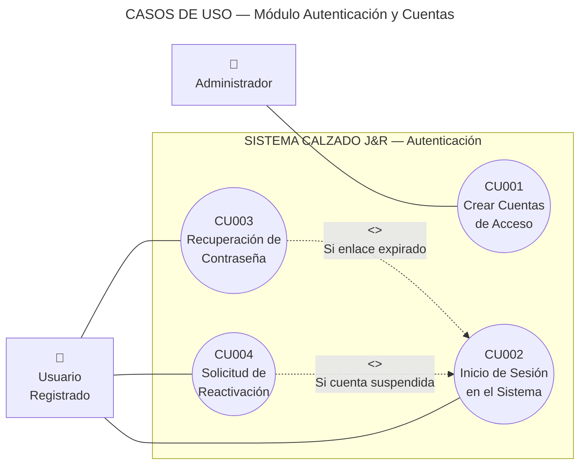
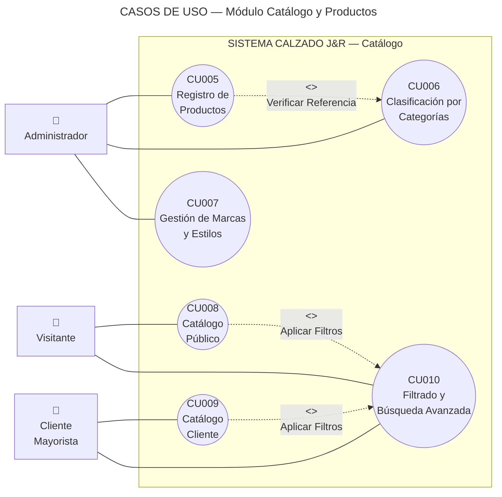
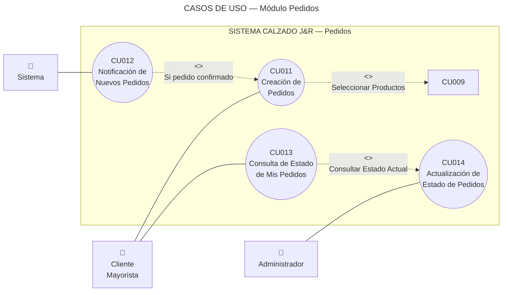
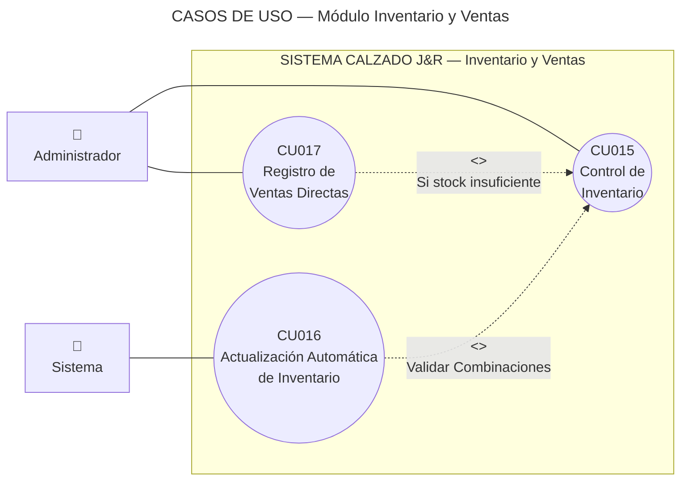
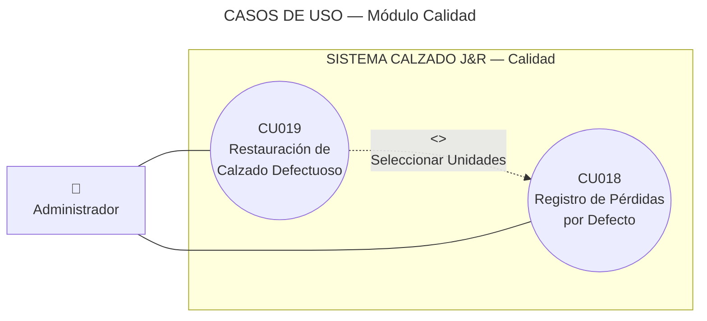
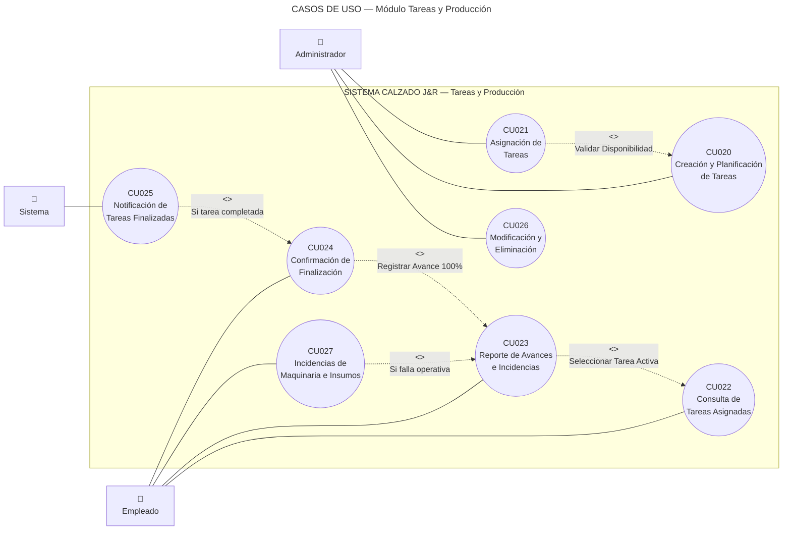
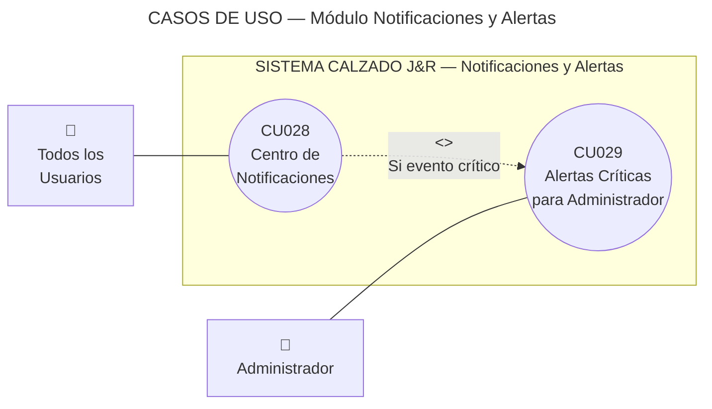
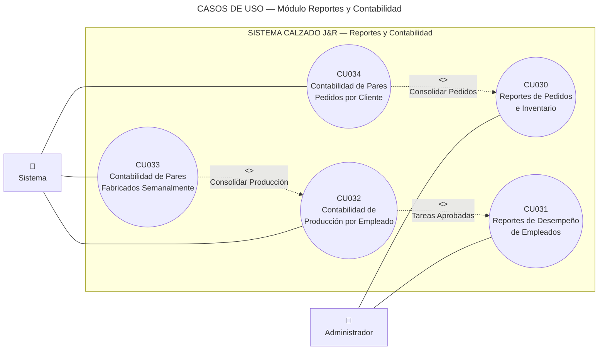
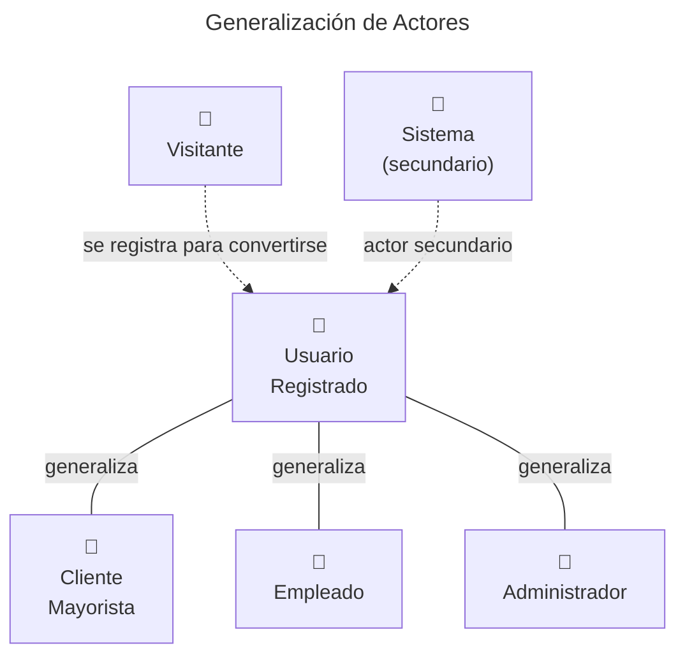

# Diagrama General de Casos de Uso (UML) — por Módulos

**Sistema:** CALZADO J&R — Sistema de Gestión y Producción de Calzado
**Autor:** Ronald Guerrero
**Última Actualización:** 2 de Agosto de 2026
**Fuente:** `casos de uso.docx.md` (CU001–CU034)

---

## 1. Simbología UML Normalizada

| Elemento | Símbolo | Descripción |
|----------|---------|-------------|
| **Actor** | 🧍 Monigote | Rol externo que interactúa con el sistema (persona u otro sistema). |
| **Caso de Uso** | ⬭ Óvalo | Funcionalidad que el sistema ofrece a un actor. |
| **Asociación** | ──── línea sólida | Comunicación entre un actor y un caso de uso. |
| **Límite del Sistema** | ⬜ Rectángulo | Marco que delimita qué funcionalidades pertenecen al software. |
| **`<<include>>`** | ┄┄▶ línea discontinua con flecha | Inclusión obligatoria: el caso base siempre ejecuta la lógica incluida. |
| **`<<extend>>`** | ┄┄▶ línea discontinua con flecha | Extensión opcional/condicional: solo se ejecuta bajo una condición. |
| **Generalización** | ──▷ línea sólida con triángulo | Herencia entre actores o entre casos de uso. |

> **Nota sobre los actores:** Cada actor se representa con su silueta de monigote. Los actores primarios (personas) usan 🧍 / 👩; los actores secundarios (sistema) usan 🏢 / 🤖. Los roles que heredan de *Usuario Registrado* comparten los casos de uso de autenticación.

---

## 2. Índice de Diagramas por Módulo

| # | Módulo | Casos de Uso | Actor(es) |
|---|--------|--------------|-----------|
| 2.1 | Autenticación y Cuentas | CU001–CU004 | 👩 Administrador, 🧍 Usuario Registrado |
| 2.2 | Catálogo y Productos | CU005–CU010 | 👩 Administrador, 🧍 Visitante, 🧍 Cliente Mayorista |
| 2.3 | Pedidos | CU011–CU014 | 🧍 Cliente Mayorista, 👩 Administrador, 🏢 Sistema |
| 2.4 | Inventario y Ventas | CU015–CU017 | 👩 Administrador, 🏢 Sistema |
| 2.5 | Calidad | CU018–CU019 | 👩 Administrador |
| 2.6 | Tareas y Producción | CU020–CU027 | 👩 Administrador, 🧍 Empleado, 🏢 Sistema |
| 2.7 | Notificaciones y Alertas | CU028–CU029 | 🧍 Todos los roles, 👩 Administrador |
| 2.8 | Reportes y Contabilidad | CU030–CU034 | 👩 Administrador, 🏢 Sistema |

---

## 2.1 Módulo: Autenticación y Cuentas

---

## 2.2 Módulo: Catálogo y Productos

---

## 2.3 Módulo: Pedidos

---

## 2.4 Módulo: Inventario y Ventas

---

## 2.5 Módulo: Calidad

---

## 2.6 Módulo: Tareas y Producción

---

## 2.7 Módulo: Notificaciones y Alertas

---

## 2.8 Módulo: Reportes y Contabilidad

---

## 3. Generalización de Actores

---

## 4. Relaciones Avanzadas entre Casos de Uso (resumen)

### 4.1 Relaciones `<<include>>` (Inclusión Obligatoria)

| Caso Padre | Caso Incluido | Lógica compartida | Módulo |
|------------|---------------|-------------------|--------|
| CU005 Registro de Productos | CU006 Verificar Referencia | Validación de unicidad de referencia | Catálogo |
| CU008 Catálogo Público | CU010 Aplicar Filtros | Filtrado y búsqueda del catálogo | Catálogo |
| CU009 Catálogo Cliente | CU010 Aplicar Filtros | Filtrado y búsqueda del catálogo | Catálogo |
| CU011 Creación de Pedidos | CU009 Seleccionar Productos | Búsqueda y selección de referencias | Pedidos |
| CU013 Consulta de Estado | CU014 Consultar Estado Actual | Obtener estado vigente del pedido | Pedidos |
| CU016 Actualización Inventario | CU015 Validar Combinaciones | Validar combinaciones referencia-talla-color | Inventario |
| CU019 Restauración | CU018 Seleccionar Unidades | Elegir unidades defectuosas a restaurar | Calidad |
| CU023 Reporte de Avances | CU022 Seleccionar Tarea Activa | Elegir la tarea en progreso a reportar | Tareas |
| CU024 Finalización | CU023 Registrar Avance 100% | Registrar el avance antes de finalizar | Tareas |
| CU032 Contabilidad Empleado | CU031 Tareas Aprobadas | Tareas aprobadas por supervisión | Reportes |
| CU033 Contabilidad Semanal | CU032 Consolidar Producción | Consolidar producción aprobada | Reportes |
| CU034 Contabilidad Cliente | CU030 Consolidar Pedidos | Consolidar pedidos del mes | Reportes |

### 4.2 Relaciones `<<extend>>` (Extensión Opcional / Condicional)

| Caso Base | Caso Extendido | Condición de Activación | Módulo |
|-----------|----------------|--------------------------|--------|
| CU002 Inicio de Sesión | CU003 Recuperación | El enlace de recuperación expira | Autenticación |
| CU002 Inicio de Sesión | CU004 Reactivación | La cuenta está "Suspendida" | Autenticación |
| CU011 Creación de Pedidos | CU012 Notificación | El pedido se confirma | Pedidos |
| CU017 Registro de Ventas | CU015 Consulta Inventario | El stock resulta insuficiente | Inventario |
| CU023 Reporte de Avances | CU027 Incidencias | Se detecta falla operativa o falta de insumo | Tareas |
| CU024 Finalización | CU025 Notificación | La tarea se completa | Tareas |
| CU028 Centro de Notificaciones | CU029 Alertas Críticas | Se genera un evento crítico | Notificaciones |

### 4.3 Generalización / Herencia

| Padre | Hijo | Relación |
|-------|------|----------|
| Usuario Registrado | Cliente Mayorista | Un cliente mayorista es un usuario registrado |
| Usuario Registrado | Empleado | Un empleado es un usuario registrado |
| Usuario Registrado | Administrador | Un administrador es un usuario registrado |
| CU010 Búsqueda Avanzada | CU008 Catálogo Público | El catálogo público usa la búsqueda |
| CU010 Búsqueda Avanzada | CU009 Catálogo Cliente | El catálogo de cliente usa la búsqueda |

---

## 5. Notas Importantes

1. **Límite del Sistema:** Cada módulo tiene su propio límite (`subgraph`) que delimita las funcionalidades que pertenecen al software CALZADO J&R. Los actores siempre quedan **fuera** del límite.

2. **Siluetas de actores:** Los actores primarios (personas) se representan con 🧍 / 👩 y los actores secundarios (procesos automáticos) con 🏢.

3. **Actor Sistema:** Los casos CU012, CU016, CU025, CU032, CU033 y CU034 son **automatizados** y no requieren intervención humana; el actor "Sistema" los dispara por eventos o programación (corte semanal/mensual).

4. **Herencia de Actores:** Cliente Mayorista, Empleado y Administrador heredan automáticamente los casos de uso de Usuario Registrado (CU002, CU003, CU004, CU028) vistos en el módulo de Autenticación y Notificaciones.
