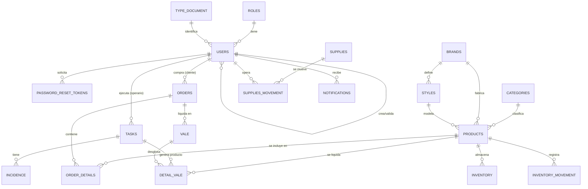

# 📊 Diccionario de Datos - CALZADO J&R

Este documento proporciona una descripción detallada de la estructura de la base de datos de **CALZADO J&R**. El sistema utiliza PostgreSQL 17-alpine y gestiona la producción, inventario, ventas y personal.

---

## 🏗️ Resumen General
- **Motor:** PostgreSQL 17
- **Total de Tablas:** 19
- **Extensiones:** `uuid-ossp` para generación de IDs únicos.
- **Estrategia de Borrado:** Soft Delete (`deleted_at`) en tablas críticas.
- **Auditoría:** La mayoría de las tablas incluyen `created_by`, `updated_by` y `deleted_by` vinculados a la tabla `users`.

---

## ♾️ Tipos Enumerados (ENUMS)

| Nombre | Valores | Descripción |
| :--- | :--- | :--- |
| **occupation_type** | jefe, cortador, guarnecedor, solador, emplantillador | Cargos operativos en la fábrica. |
| **supplies_movement_type** | entrada, salida | Tipo de flujo de materia prima. |
| **inventory_movement_type** | entrada, salida, ajuste | Tipo de flujo de producto terminado. |
| **order_status** | pendiente, en_progreso, completado, cancelado | Estado de un pedido mayorista. |
| **task_status** | pendiente, en_progreso, completado, cancelado | Estado de una tarea de producción. |
| **task_priority** | baja, media, alta | Prioridad de las tareas asignadas. |
| **task_type** | corte, guarnicion, soladura, emplantillado | Etapa de producción de calzado. |
| **incidence_status** | abierta, en_progreso, resuelta, cerrrada | Estado de un reporte de problema. |
| **notification_type** | info, advertencia, error, exito | Nivel visual de la notificación. |

---

## 📑 Tablas Operacionales

### 1. ROLES
**Propósito:** Define los niveles de acceso al sistema.

| Campo | Tipo | Restricciones | Descripción |
| :--- | :--- | :--- | :--- |
| **id** | UUID | PK, DEFAULT uuid_generate_v4() | ID único del rol. |
| **name_role** | VARCHAR(50) | UNIQUE, NOT NULL | Nombre (admin, employee, client). |
| **description_role** | VARCHAR(255) | | Explicación del alcance del rol. |
| **created_at** | TIMESTAMP+TZ | DEFAULT NOW() | Fecha de creación. |
| **updated_at** | TIMESTAMP+TZ | DEFAULT NOW() | Última actualización. |
| **deleted_at** | TIMESTAMP+TZ | | Fecha de eliminación lógica. |

---

### 2. TYPE_DOCUMENT
**Propósito:** Clasificación de documentos de identidad (C.C., NIT, etc.).

| Campo | Tipo | Restricciones | Descripción |
| :--- | :--- | :--- | :--- |
| **id** | UUID | PK, DEFAULT uuid_generate_v4() | ID único. |
| **name_type_document** | VARCHAR(100) | UNIQUE, NOT NULL | Nombre del tipo de documento. |
| **created_at** | TIMESTAMP+TZ | DEFAULT NOW() | Fecha de creación. |
| **updated_at** | TIMESTAMP+TZ | DEFAULT NOW() | Última actualización. |
| **deleted_at** | TIMESTAMP+TZ | | Fecha de eliminación lógica. |

---

### 3. USERS
**Propósito:** Entidad central que gestiona credenciales de acceso, perfiles de empleados y clientes.

| Campo | Tipo | Restricciones / FK | Descripción |
| :--- | :--- | :--- | :--- |
| **id** | UUID | PK | ID único de usuario. |
| **email** | VARCHAR(255) | UNIQUE, NOT NULL | Correo electrónico (login). |
| **hashed_password** | VARCHAR(255) | NOT NULL | Contraseña cifrada. |
| **name_user** | VARCHAR(255) | NOT NULL | Nombres. |
| **last_name** | VARCHAR(255) | NOT NULL | Apellidos. |
| **phone** | VARCHAR(20) | | Teléfono de contacto. |
| **identity_document** | VARCHAR(20) | | Número de documento físico. |
| **identity_document_type_id** | UUID | FK → `type_document(id)` | Tipo de documento. |
| **role_id** | UUID | FK → `roles(id)`, NOT NULL | Rol asignado. |
| **is_active** | BOOLEAN | DEFAULT FALSE | Si la cuenta puede loguearse. |
| **is_validated** | BOOLEAN | DEFAULT FALSE | Aprobación por parte de un Jefe. |
| **must_change_password** | BOOLEAN | DEFAULT FALSE | Forzar cambio en próximo inicio. |
| **business_name** | VARCHAR(255) | | Razón social (solo para Clientes). |
| **occupation** | ENUM | occupation_type | Cargo (solo para Empleados). |
| **validated_by** | UUID | FK → `users(id)` | Jefe que validó al usuario. |
| **validated_at** | TIMESTAMP+TZ | | Fecha de validación. |
| **created_by** | UUID | FK → `users(id)` | Usuario que creó el registro. |
| **updated_by** | UUID | FK → `users(id)` | Usuario que editó el registro. |
| **deleted_by** | UUID | FK → `users(id)` | Usuario que eliminó el registro. |
| **created_at** | TIMESTAMP+TZ | DEFAULT NOW() | Auditoría temporal. |

---

### 4. PASSWORD_RESET_TOKENS
**Propósito:** Almacena tokens temporales para recuperación de contraseñas.

| Campo | Tipo | Restricciones / FK | Descripción |
| :--- | :--- | :--- | :--- |
| **id** | UUID | PK | ID único. |
| **user_id** | UUID | FK → `users(id)`, NOT NULL | Propietario del token. |
| **token** | VARCHAR(255) | UNIQUE, NOT NULL | Hash del token de seguridad. |
| **expires_at** | TIMESTAMP+TZ | NOT NULL | Fecha de expiración. |
| **used** | BOOLEAN | DEFAULT FALSE | Indica si ya fue canjeado. |
| **created_by** | UUID | FK → `users(id)` | Usuario creador. |
| **created_at** | TIMESTAMP+TZ | DEFAULT NOW() | Fecha emisión. |

---

### 5. SUPPLIES
**Propósito:** Listado Maestro de Insumos (Ceros, hilos, suelas, etc.).

| Campo | Tipo | Restricciones | Descripción |
| :--- | :--- | :--- | :--- |
| **id** | UUID | PK | ID único. |
| **name_supplies** | VARCHAR(255) | NOT NULL | Nombre del insumo. |
| **description_supplies** | TEXT | | Detalles técnicos. |
| **created_by** | UUID | FK → `users(id)` | Auditoría. |
| **updated_by** | UUID | FK → `users(id)` | Auditoría. |
| **deleted_by** | UUID | FK → `users(id)` | Auditoría. |
| **created_at / updated_at** | TIMESTAMP+TZ | DEFAULT NOW() | Timestamps. |

---

### 6. SUPPLIES_MOVEMENT
**Propósito:** Registro histórico de entradas y salidas de materia prima de bodega.

| Campo | Tipo | Restricciones / FK | Descripción |
| :--- | :--- | :--- | :--- |
| **id** | UUID | PK | ID único. |
| **supplies_id** | UUID | FK → `supplies(id)`, NOT NULL | El insumo movido. |
| **user_id** | UUID | FK → `users(id)`, NOT NULL | Usuario que opera el movimiento. |
| **type_of_movement** | ENUM | supplies_movement_type | Entrada o Salida. |
| **amount** | NUMERIC(10,2) | NOT NULL | Cantidad movida. |
| **colour** | VARCHAR(100) | | Color del insumo si aplica. |
| **size** | VARCHAR(50) | | Talla del insumo si aplica. |
| **movement_date** | TIMESTAMP+TZ | NOT NULL | Fecha efectiva. |

---

### 7. CATEGORIES
**Propósito:** Categorización del calzado (Deportivo, Casual, Botas, etc.).

| Campo | Tipo | Restricciones | Descripción |
| :--- | :--- | :--- | :--- |
| **id** | UUID | PK | ID único. |
| **name_category** | VARCHAR(255) | UNIQUE, NOT NULL | Nombre único. |
| **description_category** | TEXT | | Descripción. |
| **created_by / updated_at** | Mixed | FK / TIMESTAMP | Auditoría estándar. |

---

### 8. BRANDS
**Propósito:** Marcas comerciales de calzado manejadas.

| Campo | Tipo | Restricciones | Descripción |
| :--- | :--- | :--- | :--- |
| **id** | UUID | PK | ID único. |
| **name_brand** | VARCHAR(255) | UNIQUE, NOT NULL | Ej. "Nike", "Adidas", "Propios". |
| **description_brand** | TEXT | | Detalles de la marca. |

---

### 9. STYLES
**Propósito:** Estilos o modelos específicos dentro de una marca.

| Campo | Tipo | Restricciones / FK | Descripción |
| :--- | :--- | :--- | :--- |
| **id** | UUID | PK | ID único. |
| **brand_id** | UUID | FK → `brands(id)`, NOT NULL | Marca a la que pertenece. |
| **name_style** | VARCHAR(255) | NOT NULL | Nombre del modelo (ej. "Air Max"). |
| **description_style** | TEXT | | Descripción del estilo. |

---

### 10. PRODUCTS (Catálogo)
**Propósito:** Definición de producto final (combinación de categoría, marca y estilo).

| Campo | Tipo | Restricciones / FK | Descripción |
| :--- | :--- | :--- | :--- |
| **id** | UUID | PK | ID único. |
| **category_id** | UUID | FK → `categories(id)` | Categoría vinculada. |
| **brand_id** | UUID | FK → `brands(id)` | Marca vinculada. |
| **style_id** | UUID | FK → `styles(id)` | Estilo vinculado. |
| **name_product** | VARCHAR(255) | NOT NULL | Nombre descriptivo. |
| **color** | VARCHAR(100) | | Color principal. |
| **image_url** | VARCHAR(500) | | Ruta a la imagen del catálogo. |
| **insufficient_threshold** | INTEGER | DEFAULT 10 | Cantidad para alerta de bajo stock. |
| **state** | BOOLEAN | DEFAULT TRUE | Habilitado/Deshabilitado. |

---

### 11. INVENTORY (Bodega Central)
**Propósito:** Stock consolidado y disponible de productos terminados.

| Campo | Tipo | Restricciones / FK | Descripción |
| :--- | :--- | :--- | :--- |
| **id** | UUID | PK | ID único. |
| **product_id** | UUID | FK → `products(id)` | Producto referenciado. |
| **size** | VARCHAR(50) | NOT NULL | Talla específica. |
| **colour** | VARCHAR(100) | | Color específico. |
| **amount** | NUMERIC(10,2) | NOT NULL | Parejas actuales en bodega. |
| **minimum_stock** | INTEGER | DEFAULT 0 | Nivel de reorden por variante. |

---

### 12. INVENTORY_MOVEMENT
**Propósito:** Auditoría y trazabilidad de cada cambio en el inventario.

| Campo | Tipo | Restricciones / FK | Descripción |
| :--- | :--- | :--- | :--- |
| **id** | UUID | PK | ID único. |
| **product_id** | UUID | FK → `products(id)` | Producto afectado. |
| **user_id** | UUID | FK → `users(id)` | Responsable del cambio. |
| **type_of_movement** | ENUM | inventory_movement_type | Entrada, Salida, Ajuste. |
| **amount** | NUMERIC(10,2) | NOT NULL | Diferencia aplicada. |
| **reason** | VARCHAR(255) | | Por qué se hizo el ajuste. |

---

### 13. TASKS
**Propósito:** Definición de tareas de producción para operarios.

| Campo | Tipo | Restricciones / FK | Descripción |
| :--- | :--- | :--- | :--- |
| **id** | UUID | PK | ID único. |
| **assigned_to** | UUID | FK → `users(id)`, NOT NULL | Operario responsable. |
| **description_task** | TEXT | NOT NULL | Instrucciones detalladas. |
| **priority** | ENUM | task_priority | Nivel de urgencia. |
| **type** | ENUM | task_type | Etapa (Corte, Solado, etc.). |
| **status** | ENUM | task_status, DEFAULT 'pendiente' | Estado actual. |
| **deadline** | TIMESTAMP+TZ | | Fecha límite pactada. |
| **assignment_date** | TIMESTAMP+TZ | NOT NULL | Fecha en que se asignó. |

---

### 14. ORDERS
**Propósito:** Encabezado de pedidos realizados por Clientes.

| Campo | Tipo | Restricciones / FK | Descripción |
| :--- | :--- | :--- | :--- |
| **id** | UUID | PK | ID pedido. |
| **customer_id** | UUID | FK → `users(id)`, NOT NULL | Cliente propietario. |
| **total_pairs** | INTEGER | NOT NULL | Suma total de pares del pedido. |
| **state** | ENUM | order_status, DEFAULT 'pendiente' | Estado del pedido. |
| **delivery_date** | TIMESTAMP+TZ | | Fecha compromiso de entrega. |
| **creation_date** | TIMESTAMP+TZ | DEFAULT NOW() | Fecha de recepción. |

---

### 15. ORDER_DETAILS
**Propósito:** Desglose del pedido por producto, talla y color.

| Campo | Tipo | Restricciones / FK | Descripción |
| :--- | :--- | :--- | :--- |
| **id** | UUID | PK | ID detalle. |
| **order_id** | UUID | FK → `orders(id)`, ON DELETE CASCADE | Pedido padre. |
| **product_id** | UUID | FK → `products(id)` | Calzado solicitado. |
| **size / colour / amount** | Text / Text / Int | NOT NULL | Especificaciones del lote solicitado. |
| **state** | ENUM | order_status | Estado de la línea (puede diferir del pedido). |

---

### 16. VALE
**Propósito:** Documento de liquidación para la entrega de trabajo terminado.

| Campo | Tipo | Restricciones / FK | Descripción |
| :--- | :--- | :--- | :--- |
| **id** | UUID | PK | ID vale. |
| **order_id** | UUID | FK → `orders(id)`, ON DELETE CASCADE | Pedido al que liquida. |
| **amount** | NUMERIC(10,2) | | Valor o cantidad total liquidada. |
| **creation_date** | TIMESTAMP+TZ | DEFAULT NOW() | Fecha emisión. |

---

### 17. DETAIL_VALE
**Propósito:** Vínculo granular entre una tarea específica, el operario y el vale de liquidación.

| Campo | Tipo | Restricciones / FK | Descripción |
| :--- | :--- | :--- | :--- |
| **id** | UUID | PK | ID detalle vale. |
| **vale_id** | UUID | FK → `vale(id)`, ON DELETE CASCADE | Vale padre. |
| **task_id** | UUID | FK → `tasks(id)` | Tarea origen. |
| **product_id** | UUID | FK → `products(id)` | Producto entregado. |
| **user_id** | UUID | FK → `users(id)` | Operario que entrega. |
| **amount / size / colour** | Mixed | | Datos físicos de la entrega. |

---

### 18. INCIDENCE
**Propósito:** Registro de problemas durante la producción (fallas de máquina, falta de material, etc.).

| Campo | Tipo | Restricciones / FK | Descripción |
| :--- | :--- | :--- | :--- |
| **id** | UUID | PK | ID incidencia. |
| **task_id** | UUID | FK → `tasks(id)`, NOT NULL | Tarea donde ocurrió. |
| **type_incidence** | VARCHAR(100) | NOT NULL | Categoría del problema. |
| **description_incidence** | TEXT | | Comentario del operario. |
| **state** | ENUM | incidence_status | Estado de resolución. |
| **report_date** | TIMESTAMP+TZ | NOT NULL | Fecha del reporte. |

---

### 19. NOTIFICATIONS
**Propósito:** Centro de alertas para usuarios según eventos del sistema.

| Campo | Tipo | Restricciones / FK | Descripción |
| :--- | :--- | :--- | :--- |
| **id** | UUID | PK | ID notificación. |
| **user_id** | UUID | FK → `users(id)`, NOT NULL | Destinatario. |
| **title_notification** | VARCHAR(255) | NOT NULL | Asunto. |
| **message_notification** | TEXT | NOT NULL | Contenido. |
| **type_notification** | ENUM | notification_type | Nivel de importancia. |
| **is_read** | BOOLEAN | DEFAULT FALSE | Estado de lectura. |

---

## 🗺️ Mapa de Relaciones (ERD)

---
*Ultima Sincronización: 2026-03-20*
