# 📋 Especificación de Casos de Uso (UML)

**Sistema de Gestión Integral — CALZADO J&R**

> **Versión de la especificación:** 1.0
> **Autores:** Andrés Felipe Gil Diaz, Ronald Jefrey Guerrero Mesías, Andrés Santiago Rivera Galeano
> **Fecha:** Julio 2026
> **Programa:** Análisis y Desarrollo de Software — SENA
> **Base documental:** Requisitos Funcionales (RF-001 al RF-035), Historias de Usuario, Mapa de Enrutamiento

---

## 1. Registro de Modificaciones

| Versión | Fecha | Autor | Descripción del cambio |
|---|---|---|---|
| 1.0 | Julio 2026 | Equipo CALZADO J&R | Versión inicial — Especificación completa de casos de uso |

---

## 2. Definición y Caracterización de Actores

### 2.1. Actores Principales

| # | Actor | Descripción del rol | Responsabilidades | Interfaz |
|---|---|---|---|---|
| **AP-01** | **Cliente Potencial** | Visitante no registrado que accede al catálogo público y puede solicitar una cuenta | • Consultar catálogo público • Solicitar registro como cliente mayorista | Web (React SPA) |
| **AP-02** | **Cliente Mayorista** | Usuario con cuenta activa y rol `cliente` que realiza pedidos de calzado | • Iniciar sesión • Consultar catálogo completo • Realizar pedidos • Consultar estado de pedidos • Gestionar perfil | Web (React SPA) |
| **AP-03** | **Jefe / Administrador** | Dueño de la fábrica o administrador con rol `admin` y ocupación `jefe`. Control total del sistema | • Gestionar usuarios (crear, validar, activar) • Gestionar catálogo, marcas, categorías • Gestionar pedidos e inventario • Asignar y supervisar tareas • Gestionar insumos • Ver reportes y alertas • Gestionar incidencias y pérdidas | Web (React SPA) |
| **AP-04** | **Empleado** | Trabajador de planta con roles `admin` o `employee` y ocupaciones como `cortador`, `guarnecedor`, `solador`, `emplantillador` | • Consultar tareas asignadas • Reportar avances e incidencias • Confirmar finalización de tareas • Ver reportes personales • Gestionar perfil | Web (React SPA) |
| **AP-05** | **Diseñador de Producto** | Usuario que puede crear y gestionar productos en el catálogo | • Crear/modificar productos • Gestionar imágenes | Web (React SPA) |

### 2.2. Actores Secundarios

| # | Actor | Descripción | Protocolo / Interfaz |
|---|---|---|---|
| **AS-01** | **Servicio de Correo (SMTP)** | Sistema de envío de correos electrónicos (Mailpit en desarrollo, SMTP real en producción) | SMTP asíncrono vía `aiosmtplib` |
| **AS-02** | **Servidor de Base de Datos (PostgreSQL)** | Motor de base de datos relacional que persiste todos los datos del sistema | SQL vía SQLAlchemy ORM (TCP 5432) |
| **AS-03** | **Servicio WebSocket** | Canal de comunicación bidireccional para notificaciones en tiempo real | WebSocket sobre HTTP |

### 2.3. Jerarquía de Actores

```
                ┌──────────────────────────┐
                │   Visitante (No auth)     │
                │  (Cliente Potencial)      │
                └────────────┬─────────────┘
                             │ hereda
                ┌────────────▼─────────────┐
                │   Usuario Autenticado     │
                │  (Puede iniciar sesión)   │
                └────┬─────┬──────┬───────┘
                     │     │      │
            ┌────────┘     │      └──────────┐
            ▼              ▼                  ▼
    ┌───────────────┐ ┌───────────┐ ┌──────────────────┐
    │   Cliente     │ │ Empleado  │ │ Jefe / Admin     │
    │  Mayorista    │ │ (cortador,│ │ (control total)   │
    │               │ │ guarnecedor│ │                   │
    │ • Crear       │ │ • solador,│ │ • Gestionar       │
    │   pedidos     │ │ emplanti- │ │   usuarios        │
    │ • Consultar   │ │ llador)   │ │ • Gestionar       │
    │   estado      │ │           │ │   catálogo        │
    │               │ │ • Ver     │ │ • Gestionar       │
    │               │ │   tareas  │ │   pedidos         │
    │               │ │ • Reportar│ │ • Asignar tareas  │
    │               │ │   avances │ │ • Reportes        │
    └───────────────┘ └───────────┘ └──────────────────┘
```

---

## 3. Diagrama General de Casos de Uso (UML)

### 3.1. Convenciones del Diagrama

- **Actor** (monigote): Entidad externa que interactúa con el sistema.
- **Caso de uso** (óvalo): Funcionalidad que el sistema ofrece al actor.
- **`<<include>>`**: El caso de uso base **siempre** ejecuta el caso incluido.
- **`<<extend>>`**: El caso de uso extendido se ejecuta **solo bajo condición**.
- **Línea sin estereotipo**: Asociación directa actor ↔ caso de uso.
- **Límite del sistema** (rectángulo): Delimita las responsabilidades del software.

### 3.2. Diagrama General

```mermaid
graph TB
    subgraph "Sistema CALZADO J&R"
        direction TB

        %% === CATÁLOGO Y CONSULTAS ===
        USC1[Consultar Catálogo Público]
        USC2[Filtrar y Buscar Productos]
        USC3[Consultar Catálogo Completo]

        %% === GESTIÓN DE CUENTAS ===
        USA1[Solicitar Registro de Cuenta]
        USA2[Iniciar Sesión]
        USA3[Recuperar Contraseña]
        USA4[Solicitar Reactivación de Cuenta]
        USA5[Validar y Activar Cuentas]
        USA6[Crear Empleado]
        USA7[Gestionar Usuarios]

        %% === PEDIDOS ===
        USP1[Realizar Pedido]
        USP2[Consultar Estado de Pedidos]
        USP3[Actualizar Estado de Pedido]
        USP4[Gestionar Pedidos]

        %% === INVENTARIO ===
        USI1[Gestionar Inventario]
        USI2[Registrar Entrada de Productos]
        USI3[Registrar Venta y Descontar Stock]
        USI4[Registrar Pérdida por Defecto]
        USI5[Gestionar Restauración]

        %% === PRODUCCIÓN Y TAREAS ===
        UST1[Crear Tarea de Producción]
        UST2[Asignar Tarea a Empleado]
        UST3[Consultar Tareas Asignadas]
        UST4[Reportar Avance de Tarea]
        UST5[Confirmar Finalización de Tarea]

        %% === INSUMOS ===
        USS1[Gestionar Insumos]

        %% === INCIDENCIAS ===
        USR1[Registrar Incidencia]
        USR2[Gestionar Incidencias]

        %% === REPORTES ===
        USRP1[Generar Reportes de Pedidos]
        USRP2[Generar Reportes de Producción]
        USRP3[Ver Reporte Personal]

        %% === NOTIFICACIONES ===
        USN1[Recibir Notificaciones]
    end

    %% === ACTORES ===
    A1(("Cliente Potencial"))
    A2(("Cliente Mayorista"))
    A3(("Jefe / Administrador"))
    A4(("Empleado"))
    A5(("Diseñador Producto"))

    %% === RELACIONES CLIENTE POTENCIAL ===
    A1 --> USC1
    A1 --> USA1
    USC2 --> USI1

    %% === RELACIONES CLIENTE MAYORISTA ===
    A2 --> USA2
    A2 --> USC3
    A2 --> USP1
    A2 --> USP2
    USA3 --> A2

    %% === RELACIONES JEFE / ADMIN ===
    A3 --> USA5
    A3 --> USA6
    A3 --> USA7
    A3 --> USP3
    A3 --> USP4
    A3 --> USI1
    A3 --> USI2
    A3 --> USI3
    A3 --> USI4
    A3 --> USI5
    A3 --> UST1
    A3 --> UST2
    A3 --> USS1
    A3 --> USR2
    A3 --> USRP1
    A3 --> USRP2

    %% === RELACIONES EMPLEADO ===
    A4 --> UST3
    A4 --> UST4
    A4 --> UST5
    A4 --> USR1
    A4 --> USRP3

    %% === RELACIONES DISEÑADOR ===
    A5 --> USC2

    %% === RELACIONES <<include>> ===
    USP1 -->|<<include>>| USA2
    USP3 -->|<<include>>| USA2
    UST2 -->|<<include>>| USA2
    USI1 -->|<<include>>| USA2

    %% === RELACIONES <<extend>> ===
    USP1 -.->|<<extend>>| USI3
    USI4 -.->|<<extend>>| USI5
```



### 3.3. Relaciones Avanzadas entre Casos de Uso

| Relación | Tipo | Caso base | Caso dependiente | Condición |
|---|---|---|---|---|
| `<<include>>` | Inclusión obligatoria | Realizar Pedido | Iniciar Sesión | El cliente debe estar autenticado para pedir |
| `<<include>>` | Inclusión obligatoria | Actualizar Estado de Pedido | Iniciar Sesión | El admin debe estar autenticado |
| `<<include>>` | Inclusión obligatoria | Asignar Tarea | Iniciar Sesión | El admin debe estar autenticado |
| `<<include>>` | Inclusión obligatoria | Gestionar Inventario | Iniciar Sesión | El admin debe estar autenticado |
| `<<extend>>` | Extensión condicional | Realizar Pedido | Registrar Venta y Descontar Stock | Si el producto está en bodega con stock disponible |
| `<<extend>>` | Extensión condicional | Registrar Pérdida por Defecto | Gestionar Restauración | Si el producto defectuoso es recuperable |

---

## 4. Especificación Detallada de Casos de Uso

### 4.1. CU-01: Solicitar Registro de Cuenta

| Campo | Valor |
|---|---|
| **Identificador y Nombre** | CU-01: Solicitar Registro de Cuenta |
| **Actor(es) Involucrado(s)** | Cliente Potencial (principal); Servicio de Correo (secundario) |
| **Propósito / Descripción** | Permitir que un cliente potencial solicite una cuenta de acceso al sistema para convertirse en cliente mayorista. El sistema registra la solicitud en estado "pendiente de validación" y notifica al administrador. |
| **Precondiciones** | • El visitante no debe tener una cuenta activa con el mismo correo, documento o NIT |
| **Disparador (Trigger)** | El usuario hace clic en "Registrarse" o "Solicitar cuenta" desde la página principal |
| **Flujo Principal** | 1. El usuario accede al formulario de registro desde la página principal.<br>2. El sistema muestra el formulario con campos: nombre completo, correo electrónico, tipo de documento, número de documento, teléfono, razón social y NIT.<br>3. El usuario completa los campos obligatorios con datos válidos.<br>4. El sistema valida en tiempo real que el correo, documento y NIT no estén registrados.<br>5. El usuario envía el formulario.<br>6. El sistema crea un registro de usuario con estado "pendiente de validación".<br>7. El sistema asigna un identificador único de solicitud.<br>8. El sistema muestra acuse de recibo en pantalla: "Solicitud recibida. Recibirá un correo cuando su cuenta sea activada."<br>9. El sistema envía correo automático al usuario confirmando la recepción.<br>10. El sistema genera notificación inmediata al panel del administrador. |
| **Flujos Alternativos** | • **FA01 — Cliente ya registrado:** Si el correo ya existe pero la cuenta está pendiente, el sistema redirige al usuario a una página de estado de su solicitud mostrando "Su solicitud ya fue registrada y está en revisión."<br>• **FA02 — Reintento con NIT existente:** Si el NIT ya está registrado con otro correo, el sistema muestra mensaje: "El NIT ingresado ya se encuentra registrado en el sistema." |
| **Flujos de Excepción / Errores** | • **E01 — Datos incompletos:** Si el formulario tiene campos obligatorios vacíos, el sistema impide el envío y resalta los campos faltantes.<br>• **E02 — Formato de correo inválido:** Si el correo no tiene formato válido, el sistema muestra "Ingrese un correo electrónico válido."<br>• **E03 — Error de conexión:** Si falla la conexión con la BD, el sistema muestra "Error al procesar la solicitud. Intente nuevamente." y registra el evento en auditoría.<br>• **E04 — Duplicidad detectada:** Si correo, documento o NIT ya existen en BD activa, el sistema bloquea el registro con mensaje específico. |
| **Postcondiciones** | • El registro queda almacenado en BD con estado "pendiente de validación".<br>• El administrador recibe notificación en menos de 30 segundos.<br>• El cliente recibe correo de confirmación de recepción.<br>• Todo el proceso queda registrado en el historial de auditoría con marca de tiempo, IP del solicitante y datos suministrados. |
| **Requisitos No Funcionales Relacionados** | • RNF-001.4 (Validación de entradas frontend y backend)<br>• RNF-001.5 (Protección contra inyección SQL)<br>• RNF-002.1 (Tiempo de respuesta API < 500ms) |

---

### 4.2. CU-02: Iniciar Sesión

| Campo | Valor |
|---|---|
| **Identificador y Nombre** | CU-02: Iniciar Sesión |
| **Actor(es) Involucrado(s)** | Cliente Mayorista, Empleado, Jefe/Administrador (principales) |
| **Propósito / Descripción** | Autenticar a un usuario registrado y activo mediante correo y contraseña, redirigiéndolo al panel correspondiente según su rol. |
| **Precondiciones** | • El usuario debe tener una cuenta registrada con estado "activa"<br>• La cuenta no debe estar bloqueada por intentos fallidos |
| **Disparador (Trigger)** | El usuario hace clic en "Iniciar sesión" desde la página principal (modal de login) |
| **Flujo Principal** | 1. El usuario ingresa su correo electrónico y contraseña.<br>2. El sistema valida que ambos campos estén completos.<br>3. El sistema verifica que el correo exista y que la contraseña coincida (bcrypt).<br>4. El sistema genera un access token (JWT, 15 min) y un refresh token (7 días).<br>5. El sistema almacena los tokens en sessionStorage del navegador.<br>6. El sistema redirige al usuario al panel correspondiente a su rol:<br>   - `admin` + `jefe` → `/dashboard/admin`<br>   - `employee` → `/dashboard/employee`<br>   - `cliente` → `/dashboard/client` |
| **Flujos Alternativos** | • **FA01 — Cuenta pendiente:** Si la cuenta está en estado "pendiente de validación", el sistema muestra "Su cuenta está pendiente de aprobación por el administrador."<br>• **FA02 — Cuenta suspendida/inactiva:** Si la cuenta está suspendida, el sistema muestra "Su cuenta se encuentra suspendida. Solicite reactivación." y ofrece enlace al formulario de reactivación.<br>• **FA03 — Debe cambiar contraseña:** Si es el primer inicio (`must_change_password=true`), el sistema fuerza el cambio de contraseña antes de continuar. |
| **Flujos de Excepción / Errores** | • **E01 — Credenciales incorrectas:** Si el correo no existe o la contraseña no coincide, el sistema muestra mensaje genérico "Correo o contraseña incorrectos." sin revelar cuál falló.<br>• **E02 — Cuenta bloqueada:** Tras 3 intentos fallidos en 5 minutos, el sistema bloquea la cuenta por 30 minutos y muestra "Demasiados intentos fallidos. Intente nuevamente en 30 minutos."<br>• **E03 — Sesión expirada:** Si el access token expiró, el sistema usa el refresh token para renovarlo automáticamente. |
| **Postcondiciones** | • El usuario queda autenticado en el sistema con sesión activa.<br>• Los tokens JWT están almacenados en el navegador.<br>• El intento de acceso (exitoso o fallido) queda registrado en auditoría con IP y timestamp. |
| **Requisitos No Funcionales Relacionados** | • RNF-001.2 (JWT con HS256, access 15min, refresh 7d)<br>• RNF-001.3 (Prevención de enumeración de usuarios)<br>• RNF-001.8 (Fortaleza de contraseñas)<br>• RNF-001.1 (Hashing bcrypt) |

---

### 4.3. CU-03: Validar y Activar Cuenta de Cliente

| Campo | Valor |
|---|---|
| **Identificador y Nombre** | CU-03: Validar y Activar Cuenta de Cliente |
| **Actor(es) Involucrado(s)** | Jefe/Administrador (principal); Servicio de Correo (secundario) |
| **Propósito / Descripción** | Permitir al administrador revisar las solicitudes de registro pendientes, aprobarlas o rechazarlas, y en caso de aprobación generar credenciales temporales y notificar al cliente. |
| **Precondiciones** | • Debe existir al menos una solicitud de registro en estado "pendiente de validación"<br>• El administrador debe haber iniciado sesión |
| **Disparador (Trigger)** | El administrador accede al módulo "Validar Cuentas" y selecciona una solicitud pendiente |
| **Flujo Principal** | 1. El administrador ingresa al módulo de validación de cuentas.<br>2. El sistema muestra lista de solicitudes pendientes con todos los datos del solicitante.<br>3. El administrador selecciona una solicitud y revisa la información.<br>4. El administrador hace clic en "Aprobar".<br>5. El sistema valida que el correo del solicitante esté en estado válido.<br>6. El sistema genera una contraseña temporal segura (10+ caracteres con mayúscula, minúscula, número y símbolo).<br>7. El sistema encripta la contraseña y la almacena.<br>8. El sistema cambia el estado de la cuenta a "activa".<br>9. El sistema envía correo electrónico al cliente con credenciales temporales y enlace de activación válido por 24 horas.<br>10. El sistema muestra mensaje: "Cuenta activada y notificada correctamente." |
| **Flujos Alternativos** | • **FA01 — Rechazar solicitud:** El administrador hace clic en "Rechazar", el sistema solicita comentario obligatorio, lo registra, cambia el estado a "rechazada" y envía correo al cliente informando la decisión.<br>• **FA02 — Correo no enviado:** Si el envío de correo falla, el sistema muestra advertencia al administrador y mantiene la cuenta en estado "aprobada - pendiente notificación". |
| **Flujos de Excepción / Errores** | • **E01 — Datos inconsistentes:** Si la solicitud tiene datos corruptos, el sistema impide la aprobación y muestra "Los datos de la solicitud presentan inconsistencias. Contacte al área de soporte."<br>• **E02 — Correo duplicado (caso extremo):** Si entre la revisión y la aprobación otro proceso usó el mismo correo, el sistema impide la acción y muestra "El correo ya fue registrado por otra solicitud." |
| **Postcondiciones** | • La cuenta del cliente queda activa con contraseña temporal.<br>• El cliente recibe correo con instrucciones de acceso.<br>• La acción queda registrada en auditoría con ID del administrador, fecha y resultado. |
| **Requisitos No Funcionales Relacionados** | • RNF-001.1 (Hashing bcrypt para contraseña temporal)<br>• RNF-001.8 (Fortaleza de contraseñas) |

---

### 4.4. CU-04: Gestionar Catálogo (Crear Producto)

| Campo | Valor |
|---|---|
| **Identificador y Nombre** | CU-04: Gestionar Catálogo — Crear Producto |
| **Actor(es) Involucrado(s)** | Jefe/Administrador, Diseñador de Producto (principales) |
| **Propósito / Descripción** | Registrar un nuevo producto en el catálogo digital con toda la información requerida (nombre, referencia única, descripción, imagen, tallas, colores, material, categoría y marca). |
| **Precondiciones** | • El usuario debe haber iniciado sesión con rol `admin` o diseñador<br>• Deben existir categorías y marcas previamente registradas |
| **Disparador (Trigger)** | El usuario hace clic en "Nuevo Producto" desde el módulo de catálogo |
| **Flujo Principal** | 1. El usuario accede al módulo de catálogo.<br>2. El sistema muestra el formulario de creación de producto.<br>3. El usuario completa: nombre, referencia, descripción, imagen (JPG/PNG ≤ 2MB), tallas, colores, material, categoría y marca.<br>4. El usuario selecciona el estado del producto (activo/inactivo).<br>5. El sistema valida que la referencia sea única.<br>6. El sistema valida el formato y tamaño de la imagen.<br>7. El sistema registra el producto en la BD.<br>8. El sistema muestra mensaje: "Producto registrado exitosamente." |
| **Flujos Alternativos** | • **FA01 — Producto inactivo:** Si el usuario marca el producto como "inactivo", el sistema lo registra pero no lo muestra en el catálogo público.<br>• **FA02 — Subir imagen después:** El usuario puede guardar el producto primero y subir la imagen después desde la ficha del producto. |
| **Flujos de Excepción / Errores** | • **E01 — Referencia duplicada:** Si la referencia ya existe, el sistema bloquea el registro y muestra "La referencia ingresada ya existe en el catálogo."<br>• **E02 — Imagen inválida:** Si la imagen excede 2MB o no es JPG/PNG, el sistema muestra "La imagen debe ser JPG o PNG y no superar 2MB."<br>• **E03 — Categoría/marca inactiva:** Si la categoría o marca seleccionada está inactiva, el sistema muestra advertencia pero permite continuar. |
| **Postcondiciones** | • El producto queda registrado en la BD con todos sus atributos.<br>• Se genera código SKU único por combinación de modelo, color y talla.<br>• El producto se refleja en los módulos de consulta según su estado.<br>• La acción queda registrada en auditoría. |
| **Requisitos No Funcionales Relacionados** | • RNF-002.4 (Build optimizado para imágenes)<br>• RNF-001.4 (Validación de entradas)<br>• RNF-001.5 (Protección contra inyección SQL) |

---

### 4.5. CU-05: Realizar Pedido

| Campo | Valor |
|---|---|
| **Identificador y Nombre** | CU-05: Realizar Pedido |
| **Actor(es) Involucrado(s)** | Cliente Mayorista (principal); Servicio de Correo (secundario) |
| **Propósito / Descripción** | Permitir que un cliente mayorista autenticado registre un pedido de fabricación seleccionando productos del catálogo, definiendo tallas, colores y cantidades. |
| **Precondiciones** | • El cliente debe haber iniciado sesión con cuenta activa y rol `cliente`<br>• Debe existir al menos un producto activo en el catálogo |
| **Disparador (Trigger)** | El cliente hace clic en "Nuevo Pedido" desde su panel |
| **Flujo Principal** | 1. El cliente accede al módulo de pedidos.<br>2. El sistema muestra el catálogo de productos activos con tallas y colores disponibles.<br>3. El cliente selecciona uno o más productos, define talla, color y cantidad por cada uno.<br>4. El sistema valida que cada combinación exista en el catálogo.<br>5. El sistema valida que la cantidad total sea ≥ cantidad mínima configurada.<br>6. El cliente confirma el pedido.<br>7. El sistema verifica disponibilidad en bodega:<br>   - Si hay stock → marca como "aprobado para entrega"<br>   - Si no hay stock → marca como "pendiente de fabricación"<br>8. El sistema genera número de pedido único y asigna estado inicial "pendiente de revisión administrativa".<br>9. El sistema muestra confirmación con el ID del pedido.<br>10. El sistema notifica al administrador en tiempo real. |
| **Flujos Alternativos** | • **FA01 — Pedido desde favoritos:** El cliente puede seleccionar productos desde su lista de favoritos y transferirlos al formulario de pedido.<br>• **FA02 — Producto agotado:** Si una combinación específica está agotada, aparece deshabilitada en el catálogo con mensaje "Sin stock". |
| **Flujos de Excepción / Errores** | • **E01 — Cantidad mínima no alcanzada:** Si el total de pares es menor al mínimo configurable, el sistema muestra "La cantidad mínima de pedido es X pares."<br>• **E02 — Sin productos seleccionados:** Si intenta enviar sin productos, el sistema muestra "Debe seleccionar al menos un producto."<br>• **E03 — Cantidad inválida:** Si la cantidad no es un número positivo, el sistema muestra "Ingrese una cantidad válida." |
| **Postcondiciones** | • El pedido queda registrado en BD con estado "pendiente de revisión administrativa".<br>• Se genera número de pedido único.<br>• El administrador recibe notificación en tiempo real.<br>• El pedido se clasifica según disponibilidad en bodega. |
| **Requisitos No Funcionales Relacionados** | • RNF-002.1 (Tiempo de respuesta API < 500ms)<br>• RNF-001.4 (Validación de entradas)<br>• RNF-001.5 (Protección contra inyección SQL) |

---

### 4.6. CU-06: Crear y Asignar Tarea de Producción

| Campo | Valor |
|---|---|
| **Identificador y Nombre** | CU-06: Crear y Asignar Tarea de Producción |
| **Actor(es) Involucrado(s)** | Jefe/Administrador (principal); Servicio de Correo (secundario) |
| **Propósito / Descripción** | Crear una tarea operativa vinculada a una orden de producción y asignarla a un empleado específico, estableciendo parámetros de seguimiento y fecha límite. |
| **Precondiciones** | • El administrador debe haber iniciado sesión<br>• Debe existir al menos un empleado activo con ocupación válida<br>• Debe existir una orden de producción activa |
| **Disparador (Trigger)** | El administrador hace clic en "Nueva Tarea" desde el módulo de producción |
| **Flujo Principal** | 1. El administrador accede al módulo de tareas.<br>2. El sistema muestra el formulario de creación.<br>3. El administrador completa: título, descripción, tipo de proceso, tiempo estándar, prioridad y orden de producción vinculada.<br>4. El sistema valida que el tiempo estándar coincida con el definido en la ficha del modelo.<br>5. El administrador selecciona un empleado activo de la lista.<br>6. El sistema valida la carga de trabajo del empleado (advierte si >110%).<br>7. El administrador establece la fecha límite.<br>8. El sistema registra la tarea con estado "asignada".<br>9. El sistema notifica al empleado in-app y por correo.<br>10. El sistema muestra mensaje: "Tarea creada y asignada exitosamente." |
| **Flujos Alternativos** | • **FA01 — Sobrecarga de trabajo:** Si la asignación excede el 110% de capacidad del empleado, el sistema muestra advertencia pero permite la asignación.<br>• **FA02 — Tarea duplicada:** Si ya existe una tarea para la misma orden y proceso, el sistema muestra "Ya existe una tarea para este proceso en esta orden." |
| **Flujos de Excepción / Errores** | • **E01 — Empleado inactivo:** Si el empleado seleccionado está inactivo, el sistema bloquea la asignación y muestra "El empleado seleccionado no está activo."<br>• **E02 — Tiempo estándar inválido:** Si el tiempo ingresado no coincide con la ficha del modelo, el sistema muestra "El tiempo estándar debe coincidir con el valor definido en la ficha del modelo." |
| **Postcondiciones** | • La tarea queda registrada en BD con estado "asignada".<br>• El empleado recibe notificación in-app y por correo.<br>• La tarea aparece en el panel del empleado.<br>• La acción queda registrada en auditoría. |
| **Requisitos No Funcionales Relacionados** | • RNF-002.1 (Tiempo de respuesta API < 500ms)<br>• RNF-001.4 (Validación de entradas) |

---

### 4.7. CU-07: Reportar Avance de Tarea

| Campo | Valor |
|---|---|
| **Identificador y Nombre** | CU-07: Reportar Avance de Tarea |
| **Actor(es) Involucrado(s)** | Empleado (principal) |
| **Propósito / Descripción** | Permitir que el empleado registre el avance de una tarea asignada, incluyendo check-in, check-out, pausas, porcentaje de avance e incidencias operativas. |
| **Precondiciones** | • El empleado debe haber iniciado sesión<br>• El empleado debe tener al menos una tarea en estado "asignada" o "en progreso"<br>• El empleado no puede tener otra tarea en progreso simultáneamente |
| **Disparador (Trigger)** | El empleado hace clic en "Iniciar tarea" desde su panel de tareas |
| **Flujo Principal** | 1. El empleado accede a su panel de tareas.<br>2. El sistema muestra la lista de tareas asignadas.<br>3. El empleado selecciona una tarea y hace clic en "Iniciar".<br>4. El sistema registra la marca de tiempo de inicio (timestamp del servidor).<br>5. El sistema cambia el estado de la tarea a "en progreso".<br>6. El empleado ejecuta la tarea.<br>7. Al finalizar, el empleado hace clic en "Finalizar".<br>8. El sistema registra la marca de tiempo de fin.<br>9. El sistema calcula el tiempo real invertido y lo compara con el tiempo estándar.<br>10. El sistema muestra el resumen: tiempo invertido y eficiencia calculada. |
| **Flujos Alternativos** | • **FA01 — Pausa justificada:** Si el empleado pausa la tarea, el sistema registra la pausa y si supera el 10% del tiempo estándar solicita justificación obligatoria.<br>• **FA02 — Reporte parcial:** El empleado puede registrar un avance parcial (ej. 50%) sin finalizar la tarea, dejando la tarea en estado "en progreso". |
| **Flujos de Excepción / Errores** | • **E01 — Dos tareas simultáneas:** Si el empleado intenta iniciar una segunda tarea sin finalizar la primera, el sistema bloquea la acción y muestra "Debe finalizar la tarea actual antes de iniciar otra."<br>• **E02 — Tarea no asignada:** Si la tarea no está asignada al empleado, el sistema bloquea el reporte. |
| **Postcondiciones** | • El tiempo de ejecución queda registrado en el sistema.<br>• El estado de la tarea se actualiza (en progreso o completada).<br>• La eficiencia se calcula y almacena. |
| **Requisitos No Funcionales Relacionados** | • RNF-002.1 (Tiempo de respuesta API < 500ms) |

---

### 4.8. CU-08: Confirmar Finalización de Tarea

| Campo | Valor |
|---|---|
| **Identificador y Nombre** | CU-08: Confirmar Finalización de Tarea |
| **Actor(es) Involucrado(s)** | Empleado (principal); Jefe/Administrador (secundario — supervisión) |
| **Propósito / Descripción** | Permitir que el empleado confirme formalmente la finalización de una tarea, registrando la cantidad exacta de pares procesados y cerrando el ciclo operativo. |
| **Precondiciones** | • La tarea debe estar en estado "asignada" o "en progreso"<br>• El empleado debe ser el asignado a la tarea |
| **Disparador (Trigger)** | El empleado hace clic en "Confirmar finalización" desde el detalle de la tarea |
| **Flujo Principal** | 1. El empleado accede al detalle de la tarea.<br>2. El sistema muestra el formulario de confirmación.<br>3. El empleado ingresa la cantidad de pares procesados.<br>4. El sistema valida que la cantidad reportada coincida con la asignada (tolerancia 1%).<br>5. El empleado agrega resumen del trabajo realizado y observaciones opcionales.<br>6. El sistema cambia el estado de la tarea a "completada".<br>7. El sistema notifica al administrador con resumen de desempeño y eficiencia.<br>8. El sistema muestra mensaje: "Tarea finalizada exitosamente." |
| **Flujos Alternativos** | • **FA01 — Discrepancia mayor al 1%:** Si la cantidad reportada difiere de la asignada en más del 1%, el sistema solicita clave de supervisor para forzar la finalización y etiqueta la diferencia como "desperdicio" o "falta".<br>• **FA02 — Última tarea de la orden:** Si la tarea finalizada es la última de la orden de producción, el sistema cambia la orden a estado "pendiente de inspección de calidad" y genera alerta al control de calidad. |
| **Flujos de Excepción / Errores** | • **E01 — Tarea ya completada:** Si la tarea ya fue marcada como completada, el sistema bloquea la acción y muestra "La tarea ya fue finalizada."<br>• **E02 — Sin cantidad registrada:** Si el empleado intenta finalizar sin ingresar cantidad, el sistema muestra "Debe ingresar la cantidad de pares procesados." |
| **Postcondiciones** | • La tarea queda en estado "completada" y bloqueada para edición.<br>• El administrador recibe notificación con eficiencia calculada.<br>• Si aplica, la orden de producción avanza a "pendiente de inspección".<br>• La acción queda registrada en auditoría. |
| **Requisitos No Funcionales Relacionados** | • RNF-002.1 (Tiempo de respuesta API < 500ms) |

---

### 4.9. CU-09: Registrar Incidencia

| Campo | Valor |
|---|---|
| **Identificador y Nombre** | CU-09: Registrar Incidencia |
| **Actor(es) Involucrado(s)** | Empleado (principal); Jefe/Administrador (secundario — notificación) |
| **Propósito / Descripción** | Permitir que el empleado reporte incidencias como fallos de maquinaria, falta de insumos o condiciones inseguras que afectan la continuidad del trabajo. |
| **Precondiciones** | • El empleado debe haber iniciado sesión<br>• El empleado debe tener al menos una tarea activa (asignada o en progreso) |
| **Disparador (Trigger)** | El empleado hace clic en "Reportar incidencia" desde el detalle de una tarea activa |
| **Flujo Principal** | 1. El empleado accede al módulo de incidencias desde una tarea activa.<br>2. El sistema muestra el formulario de registro de incidencia.<br>3. El empleado selecciona: tipo de incidencia (maquinaria/insumo/seguridad/otro), descripción detallada, código del equipo o insumo afectado, foto de evidencia y área afectada.<br>4. El sistema valida los campos obligatorios.<br>5. El sistema registra la incidencia vinculada a la tarea activa.<br>6. Si el impacto es total, el sistema cambia la tarea a estado "bloqueada".<br>7. Si la incidencia es de tipo "falta de insumo crítico", genera ticket urgente al jefe de compras.<br>8. Si la incidencia es de tipo "fallo de maquinaria", genera ticket de mantenimiento.<br>9. El sistema muestra confirmación con ID de incidencia. |
| **Flujos Alternativos** | • **FA01 — Incidencia sin impacto total:** Si la incidencia no bloquea la tarea por completo, el empleado puede continuar trabajando y la tarea permanece "en progreso".<br>• **FA02 — Incidencia resuelta:** Cuando el área responsable resuelve el ticket, el sistema notifica al empleado que reportó. |
| **Flujos de Excepción / Errores** | • **E01 — Incidencia duplicada:** Si el empleado intenta reportar la misma incidencia en menos de 30 minutos, el sistema bloquea y muestra "Ya se reportó una incidencia similar recientemente."<br>• **E02 — Datos incompletos:** Si falta algún campo obligatorio, el sistema impide el envío y resalta los campos faltantes. |
| **Postcondiciones** | • La incidencia queda registrada y vinculada a la tarea.<br>• Se genera ticket automático al área responsable según el tipo.<br>• Si el impacto es total, la tarea se bloquea.<br>• Todo queda registrado en el historial técnico. |
| **Requisitos No Funcionales Relacionados** | • RNF-002.1 (Tiempo de respuesta API < 500ms) |

---

### 4.10. CU-10: Gestionar Inventario — Registrar Entrada y Salida

| Campo | Valor |
|---|---|
| **Identificador y Nombre** | CU-10: Gestionar Inventario |
| **Actor(es) Involucrado(s)** | Jefe/Administrador (principal) |
| **Propósito / Descripción** | Permitir al administrador registrar movimientos de inventario (entradas por producción, salidas por venta, ajustes manuales), mantener el stock actualizado en tiempo real y recibir alertas de stock mínimo. |
| **Precondiciones** | • El administrador debe haber iniciado sesión<br>• Deben existir productos registrados en el catálogo |
| **Disparador (Trigger)** | El administrador accede al módulo de inventario |
| **Flujo Principal** | 1. El administrador accede al módulo de inventario.<br>2. El sistema muestra el listado de productos en bodega con cantidades por SKU.<br>3. El administrador selecciona "Registrar Entrada".<br>4. El sistema muestra el formulario con campos: producto, talla, color, cantidad, origen y motivo.<br>5. El administrador completa los datos y confirma.<br>6. El sistema valida que el producto exista y que la cantidad sea positiva.<br>7. El sistema actualiza el stock (si el SKU existe, incrementa; si no, crea nuevo registro).<br>8. El sistema registra el movimiento en el historial.<br>9. El sistema muestra mensaje: "Entrada registrada exitosamente." |
| **Flujos Alternativos** | • **FA01 — Registrar salida por venta:** Similar al principal pero descontando stock. El sistema valida que haya saldo suficiente. Si no, bloquea con mensaje "El stock es insuficiente para esta salida."<br>• **FA02 — Ajuste manual:** El administrador puede realizar ajustes por conteo físico. El sistema exige motivo obligatorio. |
| **Flujos de Excepción / Errores** | • **E01 — Stock negativo:** Si se intenta registrar una salida mayor al stock disponible, el sistema bloquea la operación y muestra "Stock insuficiente."<br>• **E02 — Producto inexistente:** Si la referencia no existe en el catálogo, el sistema muestra "El producto seleccionado no existe en el catálogo." |
| **Postcondiciones** | • El stock se actualiza en tiempo real.<br>• El movimiento queda registrado en el historial con responsable y motivo.<br>• Si el stock baja del umbral mínimo, se genera alerta. |
| **Requisitos No Funcionales Relacionados** | • RNF-002.1 (Tiempo de respuesta API < 500ms)<br>• RNF-001.5 (Protección contra inyección SQL)<br>• RNF-001.4 (Validación de entradas) |

---

### 4.11. CU-11: Registrar Pérdida por Calzado Defectuoso

| Campo | Valor |
|---|---|
| **Identificador y Nombre** | CU-11: Registrar Pérdida por Calzado Defectuoso |
| **Actor(es) Involucrado(s)** | Jefe/Administrador (principal); Control de Calidad (secundario) |
| **Propósito / Descripción** | Registrar pérdidas de inventario por calzado defectuoso, moviendo el stock a "scrap stock" en lugar de simplemente restarlo, y permitiendo su posterior restauración si es viable. |
| **Precondiciones** | • El administrador debe haber iniciado sesión<br>• Debe existir stock del producto en inventario |
| **Disparador (Trigger)** | El usuario hace clic en "Registrar Pérdida" desde el módulo de pérdidas |
| **Flujo Principal** | 1. El usuario accede al módulo de pérdidas.<br>2. El sistema muestra el formulario de registro.<br>3. El usuario selecciona: producto, talla, color, cantidad, código de defecto (lista predefinida) y motivo.<br>4. El sistema valida que la combinación exista en inventario y que la cantidad no exceda el stock.<br>5. El sistema descuenta las unidades del inventario de "productos terminados".<br>6. El sistema agrega las unidades al inventario de "scrap stock" con referencia al defecto.<br>7. El sistema muestra mensaje: "Pérdida registrada. Unidades movidas a scrap stock." |
| **Flujos Alternativos** | • **FA01 — Pérdida pendiente de aprobación:** Si quien registra no es jefe de calidad, la pérdida queda en estado "pendiente de aprobación" y no se mueve el inventario hasta que el jefe de calidad apruebe.<br>• **FA02 — Producto recuperable:** Si el defecto es reparable, el sistema activa la opción de restauración (véase CU-12). |
| **Flujos de Excepción / Errores** | • **E01 — Stock insuficiente:** Si la cantidad a descontar excede el stock disponible, el sistema bloquea la operación.<br>• **E02 — Código de defecto inválido:** Si el código de defecto no pertenece a la lista predefinida, el sistema solicita un código válido. |
| **Postcondiciones** | • Las unidades defectuosas se mueven a "scrap stock".<br>• El inventario de productos terminados se reduce.<br>• El movimiento queda registrado en el historial. |
| **Requisitos No Funcionales Relacionados** | • RNF-001.4 (Validación de entradas) |

---

### 4.12. CU-12: Gestionar Restauración de Calzado Defectuoso

| Campo | Valor |
|---|---|
| **Identificador y Nombre** | CU-12: Gestionar Restauración de Calzado Defectuoso |
| **Actor(es) Involucrado(s)** | Jefe/Administrador, Jefe de Calidad (principales) |
| **Propósito / Descripción** | Gestionar el proceso de restauración de calzado defectuoso desde "scrap stock" hasta su reincorporación al inventario como producto disponible, pasando por etapas de reparación y control de calidad. |
| **Precondiciones** | • Debe existir stock en "scrap stock" con productos registrados como defectuosos<br>• El usuario debe tener rol de administrador o jefe de calidad |
| **Disparador (Trigger)** | El usuario selecciona un lote de "scrap stock" y hace clic en "Iniciar restauración" |
| **Flujo Principal** | 1. El usuario accede al módulo de restauración.<br>2. El sistema muestra los lotes disponibles en "scrap stock".<br>3. El usuario selecciona un lote y define: cantidad a restaurar, tipo de intervención y fecha estimada.<br>4. El sistema marca las unidades como "en restauración" y las bloquea en inventario disponible.<br>5. El usuario registra el progreso de la reparación.<br>6. El jefe de calidad evalúa el resultado.<br>7. Si se aprueba: el sistema reincorpora las unidades al inventario de productos terminados.<br>8. Si se rechaza: el sistema mantiene las unidades como pérdida definitiva.<br>9. El sistema registra el costo de reparación y actualiza el costo unitario. |
| **Flujos Alternativos** | • **FA01 — Restauración parcial:** Solo una parte del lote es recuperable. El sistema permite dividir el lote entre recuperado y pérdida definitiva. |
| **Flujos de Excepción / Errores** | • **E01 — Cantidad excede el scrap disponible:** Si la cantidad a restaurar excede el scrap stock, el sistema bloquea la operación.<br>• **E02 — Sin autorización de calidad:** Si el usuario no es jefe de calidad, no puede aprobar la restauración final. |
| **Postcondiciones** | • Las unidades aprobadas se reincorporan al inventario.<br>• Las unidades rechazadas se descartan como pérdida definitiva.<br>• El costo de reparación queda registrado.<br>• Todo queda registrado en el historial de restauración. |
| **Requisitos No Funcionales Relacionados** | • RNF-001.4 (Validación de entradas) |

---

### 4.13. CU-13: Generar Reportes de Pedidos e Inventario

| Campo | Valor |
|---|---|
| **Identificador y Nombre** | CU-13: Generar Reportes de Pedidos e Inventario |
| **Actor(es) Involucrado(s)** | Jefe/Administrador (principal) |
| **Propósito / Descripción** | Generar reportes consolidados sobre pedidos e inventario con filtros por fecha, estado, cliente y referencia, exportables a PDF y Excel para análisis y toma de decisiones. |
| **Precondiciones** | • El administrador debe haber iniciado sesión<br>• Debe existir data registrada (pedidos, movimientos de inventario) |
| **Disparador (Trigger)** | El administrador hace clic en "Reportes" desde el panel principal |
| **Flujo Principal** | 1. El administrador accede al módulo de reportes.<br>2. El sistema muestra las opciones de reporte disponibles.<br>3. El administrador selecciona el tipo (pedidos, inventario o combinado).<br>4. El administrador aplica filtros: rango de fechas, estado, cliente, referencia.<br>5. El sistema genera el reporte con los datos consolidados en menos de 60 segundos.<br>6. El administrador visualiza el reporte en pantalla.<br>7. El administrador puede exportar a PDF o Excel.<br>8. El sistema registra la generación del reporte en auditoría. |
| **Flujos Alternativos** | • **FA01 — Sin resultados:** Si no hay datos que coincidan con los filtros, el sistema muestra "No se encontraron datos para los filtros seleccionados." |
| **Flujos de Excepción / Errores** | • **E01 — Tiempo de generación excedido:** Si el reporte tarda más de 60 segundos, el sistema muestra "La generación del reporte está tomando más tiempo del esperado. Intente con un rango de fechas más pequeño."<br>• **E02 — Error de exportación:** Si falla la generación del archivo, el sistema muestra "Error al generar el archivo. Intente nuevamente." |
| **Postcondiciones** | • El reporte se muestra en pantalla con datos consolidados.<br>• El archivo exportado (PDF/Excel) se descarga en el navegador.<br>• El evento queda registrado en auditoría. |
| **Requisitos No Funcionales Relacionados** | • RNF-002.1 (Tiempo de respuesta: generación < 60s para 1 año de datos) |

---

### 4.14. CU-14: Recibir Notificaciones en Tiempo Real

| Campo | Valor |
|---|---|
| **Identificador y Nombre** | CU-14: Recibir Notificaciones en Tiempo Real |
| **Actor(es) Involucrado(s)** | Jefe/Administrador, Empleado, Cliente Mayorista (principales); Servicio WebSocket (secundario) |
| **Propósito / Descripción** | Recibir notificaciones automáticas en tiempo real sobre eventos relevantes como nuevos pedidos, tareas asignadas, cambios de estado, incidencias reportadas o alertas de inventario. |
| **Precondiciones** | • El usuario debe haber iniciado sesión<br>• La conexión WebSocket debe estar activa |
| **Disparador (Trigger)** | Evento automático del sistema (ej. nuevo pedido, tarea finalizada, incidencia crítica) |
| **Flujo Principal** | 1. El usuario inicia sesión en el sistema.<br>2. El sistema abre una conexión WebSocket con el token JWT del usuario.<br>3. El sistema valida el token y registra la conexión activa.<br>4. Cuando ocurre un evento relevante, el sistema envía la notificación por WebSocket.<br>5. El navegador del usuario recibe la notificación y actualiza el badge del sidebar.<br>6. El usuario puede hacer clic en la notificación para ir al módulo relacionado.<br>7. Al hacer clic, la notificación se marca como "leída". |
| **Flujos Alternativos** | • **FA01 — Notificación por correo:** Si el WebSocket no está disponible, el sistema envía la notificación por correo electrónico como fallback.<br>• **FA02 — Notificación archivada:** El usuario puede archivar notificaciones sin leerlas, ocultándolas del panel principal. |
| **Flujos de Excepción / Errores** | • **E01 — Conexión WebSocket perdida:** Si se pierde la conexión, el sistema intenta reconectar automáticamente cada 5 segundos.<br>• **E02 — Token expirado:** Si el JWT expiró durante la sesión WebSocket, el sistema cierra la conexión y espera un nuevo token. |
| **Postcondiciones** | • La notificación se muestra en el panel del usuario.<br>• El contador de notificaciones pendientes se actualiza.<br>• Si el usuario accede, se marca como "leída". |
| **Requisitos No Funcionales Relacionados** | • RNF-002.1 (Latencia < 5s para notificaciones en tiempo real) |

---

## 5. Matriz de Trazabilidad: Casos de Uso ↔ Requisitos Funcionales

| Caso de Uso | ID | RF Relacionado | Estado en código |
|---|---|---|---|
| CU-01: Solicitar Registro de Cuenta | RF-001 | Creación de Cuentas de Acceso | Implementado |
| CU-02: Iniciar Sesión | RF-003 | Inicio de Sesión | Implementado |
| CU-03: Validar y Activar Cuenta | RF-002 | Validación y Activación de Cuentas | Implementado |
| CU-04: Gestionar Catálogo | RF-006, RF-007, RF-008 | Catálogo, Categorías, Marcas | Implementado |
| CU-05: Realizar Pedido | RF-012 | Realización de Pedidos | No Implementado |
| CU-06: Crear y Asignar Tarea | RF-021, RF-022 | Creación/Asignación de Tareas | Implementado |
| CU-07: Reportar Avance de Tarea | RF-024 | Reporte de Avances e Incidencias | Parcial |
| CU-08: Confirmar Finalización de Tarea | RF-025 | Confirmación de Finalización de Tareas | Implementado |
| CU-09: Registrar Incidencia | RF-028 | Registro de Incidencias | Parcial |
| CU-10: Gestionar Inventario | RF-016, RF-017, RF-018 | Inventario, Entradas, Ventas | Implementado |
| CU-11: Registrar Pérdida | RF-019 | Registro de Pérdidas | Implementado |
| CU-12: Gestionar Restauración | RF-020 | Proceso de Restauración | Implementado |
| CU-13: Generar Reportes | RF-031, RF-032, RF-034, RF-035 | Reportes de Pedidos, Producción, Inventario | Implementado |
| CU-14: Recibir Notificaciones | RF-013, RF-026, RF-029, RF-030 | Notificaciones y Alertas | Implementado |

---

*Documento generado a partir de los requisitos funcionales (RF-001 al RF-035), historias de usuario y mapa de enrutamiento del proyecto CALZADO J&R. Los diagramas Mermaid fueron validados sintácticamente.*
