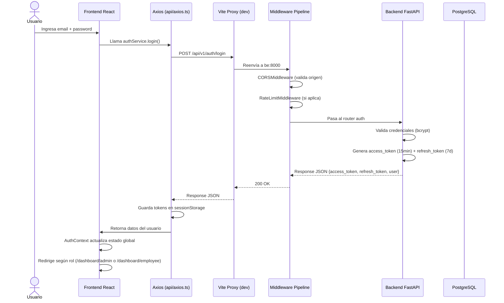
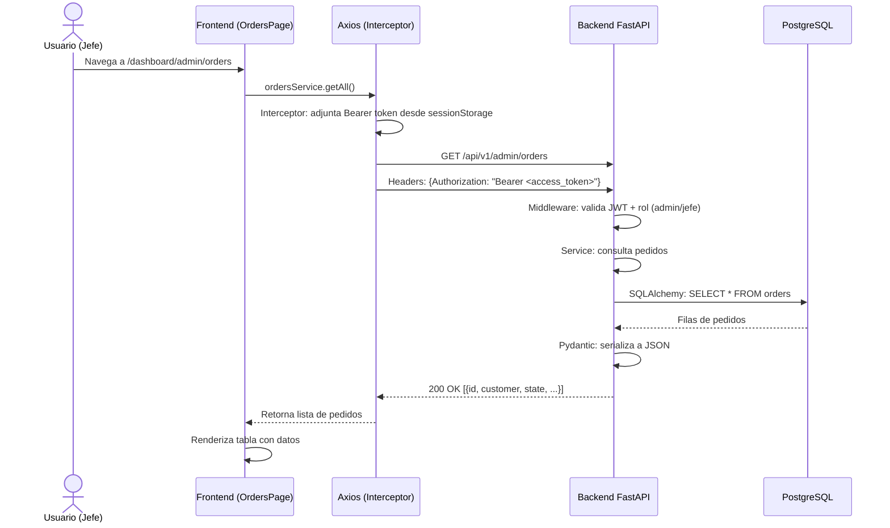
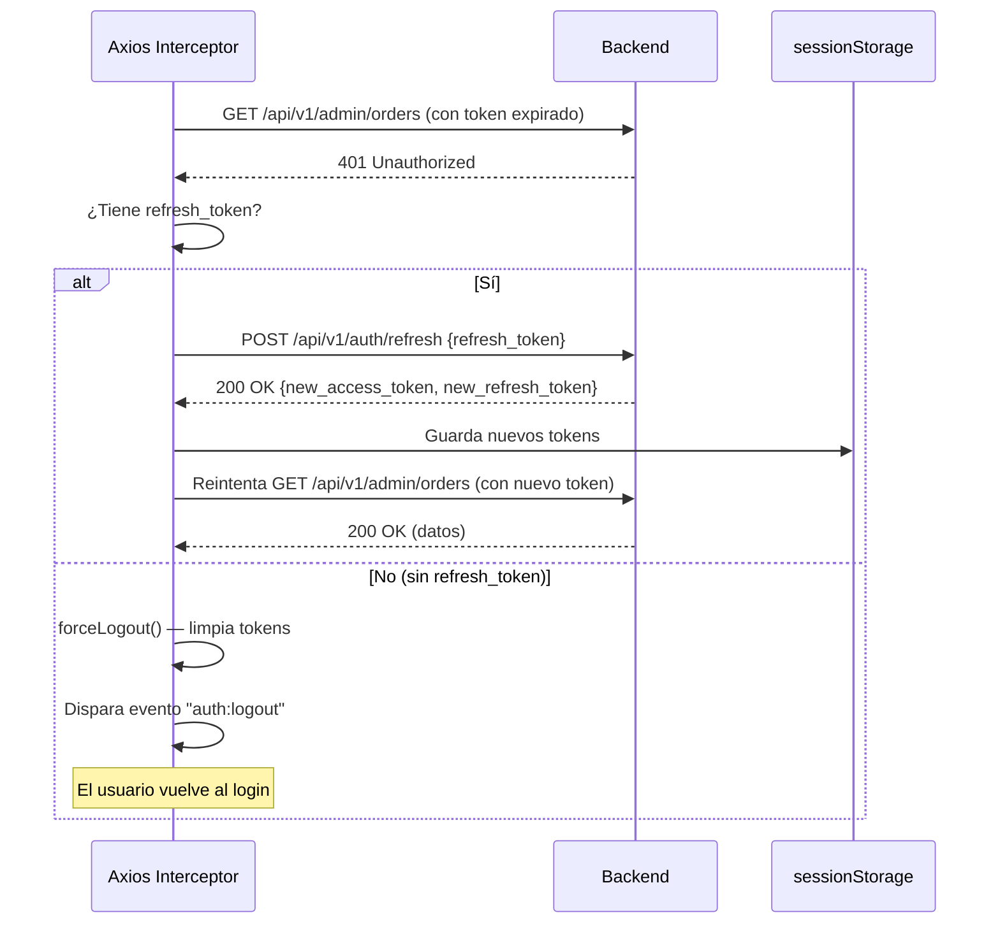
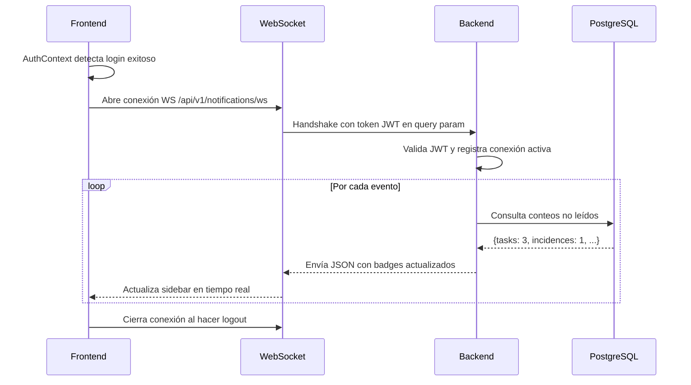
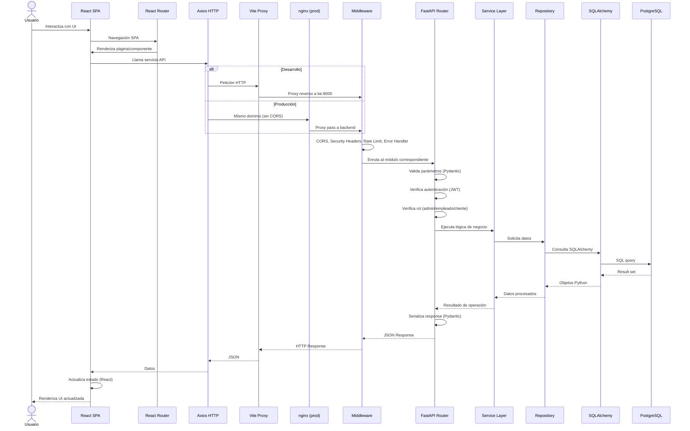

# 🗺️ Mapa de Enrutamiento y Flujo de Datos

**Sistema de Gestión Integral — CALZADO J&R**

> **Versión del documento:** 1.0
> **Última actualización:** Julio 2026
> **Stack verificado contra:** `be/app/main.py`, `be/app/modules/*/router.py`, `fe/src/App.tsx`, `fe/src/api/axios.ts`, `fe/src/config/api.ts`, `vite.config.ts`

---

## 1. Vista General del Flujo de Datos

```
┌─────────────────────────────────────────────────────────────────────────┐
│                          NAVEGADOR (Cliente)                             │
│                                                                         │
│  ┌──────────────┐    ┌──────────────────┐    ┌──────────────────────┐  │
│  │  React Router │───►│  Páginas /       │───►│  Axios (api/axios.ts)│  │
│  │  (App.tsx)    │    │  Componentes     │    │  + JWT Interceptor  │  │
│  └──────────────┘    └──────────────────┘    └──────────┬───────────┘  │
│                                                         │              │
└─────────────────────────────────────────────────────────┼──────────────┘
                                                           │
                    ┌─────────────────────────────────────┐│
                    │  Vite Proxy (dev) / nginx (prod)    ││
                    │  /api → http://be:8000              ││
                    └─────────────────────────────────────┘│
                                                           ▼
┌─────────────────────────────────────────────────────────────────────────┐
│                        BACKEND — FastAPI                                 │
│                                                                         │
│  ┌──────────────────────────────────────────────────────────────────┐   │
│  │                    MIDDLEWARE PIPELINE (orden)                    │   │
│  │  1. CORSMiddleware     — Valida origen (FRONTEND_URL)            │   │
│  │  2. SecurityHeaders    — Headers OWASP (XSS, CSP, HSTS)         │   │
│  │  3. RateLimitMiddleware— Control de intentos (solo prod/staging) │   │
│  │  4. ErrorHandler       — Captura excepciones no manejadas        │   │
│  └──────────────────────────────────────────────────────────────────┘   │
│                                                                         │
│  ┌──────────────────────────────────────────────────────────────────┐   │
│  │                      14 ROUTERS (módulos)                        │   │
│  │  /api/v1/auth  /api/v1/admin  /api/v1/orders  /api/v1/catalog  │   │
│  │  /api/v1/users /api/v1/client /api/v1/supplies  /api/v1/scrap  │   │
│  │  ...                                                             │   │
│  └──────────────────────────────────────────────────────────────────┘   │
│                          │                                              │
│  ┌──────────────────────────────────────────────────────────────────┐   │
│  │                    SERVICE LAYER (lógica de negocio)              │   │
│  └──────────────────────────────────────────────────────────────────┘   │
│                          │                                              │
│  ┌──────────────────────────────────────────────────────────────────┐   │
│  │                    REPOSITORY / SQLAlchemy ORM                    │   │
│  └──────────────────────────────────────────────────────────────────┘   │
│                          │                                              │
└──────────────────────────┼──────────────────────────────────────────────┘
                           │ TCP 5432
                           ▼
              ┌────────────────────────┐
              │   PostgreSQL 17 Alpine  │
              │   (23 modelos)          │
              └────────────────────────┘
```

---

## 2. Mapa de Enrutamiento del Frontend

### 2.1. Estructura General (App.tsx)

```
<BrowserRouter>
  <AuthProvider>
    <ToastProvider>
      <Routes>
        ├── /                           → LandingPage (público)
        ├── /catalog                    → PublicCatalogPage (público)
        │
        ├── /auth/reset-password        → ResetPasswordPage (público)
        ├── /auth/reactivation          → ReactivationPage (público)
        │
        ├── /dashboard/admin/*          → RoleProtectedRoute (admin/jefe)
        │   ├── index                   → AdminDashboardPage
        │   ├── orders                  → OrdersPage
        │   ├── catalog                 → CatalogPage
        │   ├── inventory               → InventoryPage
        │   ├── tasks                   → ProductionTaskDashboard
        │   ├── employees               → EmployeesPage
        │   ├── clients                 → ClientsPage
        │   ├── usuarios                → UsersManagementPage
        │   ├── insumos                 → InsumosPage
        │   ├── losses                  → LossesPage
        │   ├── alerts                  → AlertsPage
        │   ├── reports                 → ReportsPage
        │   └── settings                → SettingsPage
        │
        ├── /dashboard/employee/*       → RoleProtectedRoute (empleado)
        │   ├── index                   → EmployeeDashboardPage
        │   ├── tasks                   → EmployeeTasksPage
        │   ├── available-tasks         → AvailableTasksPage
        │   ├── incidences              → EmployeeIncidencesPage
        │   ├── reports                 → EmployeeReportsPage
        │   └── settings                → EmployeeSettingsPage
        │
        ├── /dashboard                  → DashboardPage (protegido)
        ├── /change-password            → ChangePasswordPage (protegido)
        │
        └── * → redirect / (catch-all)
    </Routes>
    </ToastProvider>
  </AuthProvider>
</BrowserRouter>
```

### 2.2. Compatibilidad hacia atrás (redirects)

| Ruta antigua | Redirige a |
|---|---|
| `/auth/login` | `/` |
| `/auth/register` | `/` |
| `/auth/forgot-password` | `/` |
| `/login` | `/` |
| `/register` | `/` |
| `/forgot-password` | `/` |
| `/reset-password` | `/auth/reset-password` |
| `/auth/change-password` | `/change-password` |
| `/dashboard/client` | `/` |

---

## 3. Mapa de Enrutamiento del Backend (API REST)

### 3.1. Prefijo General

Todas las rutas de la API usan el prefijo `/api/v1/`. La única excepción es el endpoint raíz `/` (mensaje de bienvenida).

### 3.2. Endpoints Generales

| Método | Ruta | Tags | Propósito |
|---|---|---|---|
| `GET` | `/` | `root` | Bienvenida API |
| `GET` | `/api/v1/health` | `health` | Health check |
| `GET` | `/api/v1/uploads/{path}` | `uploads` | Servir imágenes (avatares, productos) |

### 3.3. Módulo Auth

**Prefijo:** `/api/v1/auth` | **Tags:** `auth`

| Método | Ruta | Auth | Propósito |
|---|---|---|---|
| `POST` | `/register` | ❌ Público | Registrar nuevo cliente |
| `POST` | `/login` | ❌ Público | Iniciar sesión (retorna JWT) |
| `POST` | `/refresh` | ❌ Público | Renovar access token |
| `POST` | `/change-password` | ✅ Requiere auth | Cambiar contraseña |
| `POST` | `/forgot-password` | ❌ Público | Solicitar recuperación |
| `POST` | `/reset-password` | ❌ Público | Restablecer con token |
| `POST` | `/reactivation` | ❌ Público | Solicitar reactivación de cuenta |

### 3.4. Módulo Users

**Prefijo:** `/api/v1/users` | **Tags:** `users`

| Método | Ruta | Auth | Propósito |
|---|---|---|---|
| `GET` | `/me` | ✅ | Obtener perfil propio |
| `PATCH` | `/me` | ✅ | Actualizar perfil propio |
| `POST` | `/me/avatar` | ✅ | Subir avatar |
| `DELETE` | `/me/avatar` | ✅ | Eliminar avatar |

### 3.5. Módulo Admin

**Prefijo:** `/api/v1/admin` | **Tags:** `admin`

| Método | Ruta | Auth | Propósito |
|---|---|---|---|
| `POST` | `/create-employee` | ✅ Jefe | Crear empleado |
| `POST` | `/create-jefe` | ✅ Jefe | Crear jefe |
| `POST` | `/create-client` | ✅ Jefe | Crear cliente |
| `GET` | `/users` | ✅ Jefe | Listar usuarios con filtros |
| `GET` | `/users/{user_id}` | ✅ Jefe | Detalle de usuario |
| `PATCH` | `/users/{user_id}` | ✅ Jefe | Actualizar usuario |
| `PATCH` | `/users/{user_id}/validate` | ✅ Jefe | Validar cuenta |
| `PATCH` | `/users/{user_id}/force-password-change` | ✅ Jefe | Forzar cambio de contraseña |
| `POST` | `/reactivation-tickets` | ✅ Jefe | Listar tickets de reactivación |
| `PATCH` | `/reactivation-tickets/{ticket_id}` | ✅ Jefe | Procesar ticket |

### 3.6. Módulo Admin Catalog

**Prefijo:** `/api/v1/admin/catalog` | **Tags:** `admin-catalog`

| Método | Ruta | Auth | Propósito |
|---|---|---|---|
| `POST` | `/products` | ✅ Jefe | Crear producto |
| `PUT` | `/products/{product_id}` | ✅ Jefe | Actualizar producto |
| `DELETE` | `/products/{product_id}` | ✅ Jefe | Eliminar producto |
| `POST` | `/products/{product_id}/image` | ✅ Jefe | Subir imagen de producto |
| `POST` | `/categories` | ✅ Jefe | Crear categoría |
| `PUT` | `/categories/{category_id}` | ✅ Jefe | Actualizar categoría |
| `DELETE` | `/categories/{category_id}` | ✅ Jefe | Eliminar categoría |

### 3.7. Módulo Type Document

**Prefijo:** `/api/v1/document-types` | **Tags:** `document-types`

| Método | Ruta | Auth | Propósito |
|---|---|---|---|
| `GET` | `/` | ❌ Público | Listar tipos de documento |

### 3.8. Módulo Dashboard Jefe

**Prefijo:** `/api/v1/dashboard/admin` | **Tags:** `dashboard-jefe`

Métricas, KPIs y datos agregados del panel de control del jefe.

### 3.9. Módulo Orders

**Prefijo:** `/api/v1/admin/orders` | **Tags:** `orders`

| Método | Ruta | Auth | Propósito |
|---|---|---|---|
| `GET` | `/` | ✅ Jefe | Listar pedidos |
| `GET` | `/{order_id}` | ✅ Jefe | Detalle del pedido |
| `POST` | `/` | ✅ Jefe | Crear pedido |
| `PATCH` | `/{order_id}/status` | ✅ Jefe | Actualizar estado |
| `PATCH` | `/{order_id}/details` | ✅ Jefe | Actualizar detalles |
| `POST` | `/{order_id}/tasks` | ✅ Jefe | Generar tareas de producción |
| `PATCH` | `/tasks/{task_id}/status` | ✅ Jefe | Cambiar estado de tarea |
| `PATCH` | `/tasks/{task_id}/assign` | ✅ Jefe | Asignar empleado a tarea |

### 3.10. Módulo Catalog (público)

**Prefijo:** `/api/v1/catalog` | **Tags:** `catalog`

| Método | Ruta | Auth | Propósito |
|---|---|---|---|
| `GET` | `/products` | ❌ Público | Listar productos del catálogo |
| `GET` | `/products/{product_id}` | ❌ Público | Detalle de producto |
| `GET` | `/categories` | ❌ Público | Listar categorías |

### 3.11. Módulo Supplies

**Prefijo:** `/api/v1` | **Tags:** `supplies`

| Método | Ruta | Auth | Propósito |
|---|---|---|---|
| `GET` | `/supplies` | ✅ | Listar insumos |
| `POST` | `/supplies` | ✅ | Crear insumo |
| `PUT` | `/supplies/{supply_id}` | ✅ | Actualizar insumo |
| `DELETE` | `/supplies/{supply_id}` | ✅ | Eliminar insumo |
| `GET` | `/supplies/categories` | ✅ | Listar categorías de insumos |
| `POST` | `/supplies/categories` | ✅ | Crear categoría |
| `GET` | `/supplies/colors` | ✅ | Listar colores |
| `GET` | `/products/{id}/supplies` | ✅ | Insumos de un producto |

### 3.12. Módulo Dashboard Empleado

**Prefijo:** `/api/v1/dashboard/employee` | **Tags:** `dashboard-empleado`

Métricas y datos del panel del empleado (tareas pendientes, incidencias, rendimiento).

### 3.13. Módulo Client

**Prefijo:** `/api/v1/client` | **Tags:** `client`

Endpoints para el dashboard del cliente (historial de pedidos, perfil).

### 3.14. Módulo Notifications (WebSocket)

**Prefijo:** `/api/v1/notifications` | **Tags:** `notifications`

| Método | Ruta | Auth | Propósito |
|---|---|---|---|
| `WS` | `/ws` | ✅ | WebSocket para notificaciones en tiempo real (badges) |

### 3.15. Módulo Scrap / Incidencias

**Prefijo:** `/api/v1/scrap` (definido en `main.py`, no en el router) | **Tags:** `Scrap / Incidencias`

| Método | Ruta | Auth | Propósito |
|---|---|---|---|
| `POST` | `/` | ✅ | Registrar incidencia |
| `GET` | `/` | ✅ | Listar incidencias |
| `PATCH` | `/{scrap_id}` | ✅ | Actualizar incidencia |

---

## 4. Flujo de Datos Detallado

### 4.1. Flujo de Autenticación (Login)



### 4.2. Flujo de Petición Autenticada (Ej: Listar Pedidos)



### 4.3. Flujo de Error 401 con Refresh Automático



### 4.4. Flujo de WebSocket (Notificaciones en Tiempo Real)



---

## 5. Diagrama de Secuencia General (Todas las Capas)



---

## 6. Tabla de Rutas Frontend → API Backend (Mapeo Directo)

| Página Frontend | Ruta Frontend | Método | Endpoint API | Módulo |
|---|---|---|---|---|
| Landing | `/` | — | — | Público |
| Catálogo público | `/catalog` | `GET` | `/api/v1/catalog/products` | catalog |
| Reset Password | `/auth/reset-password` | `POST` | `/api/v1/auth/reset-password` | auth |
| Reactivación | `/auth/reactivation` | `POST` | `/api/v1/auth/reactivation` | auth |
| Dashboard Admin | `/dashboard/admin` | `GET` | `/api/v1/dashboard/admin/*` | dashboard_jefe |
| Órdenes | `/dashboard/admin/orders` | `GET` | `/api/v1/admin/orders` | orders |
| Catálogo Admin | `/dashboard/admin/catalog` | `GET` | `/api/v1/admin/catalog/products` | admin-catalog |
| Inventario | `/dashboard/admin/inventory` | `GET` | `/api/v1/admin/catalog/products` | admin-catalog |
| Tareas (Jefe) | `/dashboard/admin/tasks` | `PATCH` | `/api/v1/admin/orders/tasks/{id}` | orders |
| Empleados | `/dashboard/admin/employees` | `POST` | `/api/v1/admin/create-employee` | admin |
| Clientes | `/dashboard/admin/clients` | `POST` | `/api/v1/admin/create-client` | admin |
| Usuarios | `/dashboard/admin/usuarios` | `GET` | `/api/v1/admin/users` | admin |
| Insumos | `/dashboard/admin/insumos` | `GET` | `/api/v1/supplies` | supplies |
| Pérdidas | `/dashboard/admin/losses` | `POST` | `/api/v1/scrap` | scrap |
| Reportes (Jefe) | `/dashboard/admin/reports` | `GET` | `/api/v1/admin/reports/*` | admin-reports |
| Dashboard Empleado | `/dashboard/employee` | `GET` | `/api/v1/dashboard/employee/*` | dashboard_empleado |
| Tareas (Emp) | `/dashboard/employee/tasks` | `GET` | `/api/v1/dashboard/employee/tasks` | dashboard_empleado |
| Incidencias | `/dashboard/employee/incidences` | `POST` | `/api/v1/scrap` | scrap |
| Perfil/Settings | `/dashboard/employee/settings` | `PATCH` | `/api/v1/users/me` | users |

---

## 7. Convenciones de la API

| Aspecto | Convención |
|---|---|
| **Prefijo global** | `/api/v1/` |
| **Formato request** | `application/json` |
| **Formato response** | `application/json` |
| **Autenticación** | `Authorization: Bearer <access_token>` (header) |
| **Tokens** | Access: 15min · Refresh: 7d (vía body `{refresh_token}`) |
| **Errores** | `{ "detail": "mensaje de error" }` |
| **Errores 422** | `{ "detail": [{ "loc": [...], "msg": "...", "type": "..." }] }` |
| **Códigos HTTP** | 200 (OK), 201 (Created), 400 (Bad Request), 401 (Unauthorized), 403 (Forbidden), 404 (Not Found), 422 (Validation Error), 429 (Too Many Requests), 500 (Server Error) |
| **Paginación** | Por definir en rutas con listas grandes |
| **Versionado** | Via prefijo de ruta (`/api/v1/`) |

---

## 8. Middleware Pipeline (Orden de Ejecución)

Las peticiones atraviesan los middlewares en el orden inverso al que se registran:

```
Request entrante
    ↓
1. CORSMiddleware       (el más externo)
    ↓
2. SecurityHeadersMiddleware
    ↓
3. RateLimitMiddleware
    ↓
4. ErrorHandlerMiddleware
    ↓
   FastAPI Router (endpoint específico)
    ↓
   Response saliente (recorre en orden inverso)
```

---

*Documento generado a partir de la verificación directa de los archivos de enrutamiento del proyecto (`be/app/main.py`, `be/app/modules/*/router.py`, `fe/src/App.tsx`, `fe/src/api/axios.ts`, `fe/src/config/api.ts`, `vite.config.ts`).*
